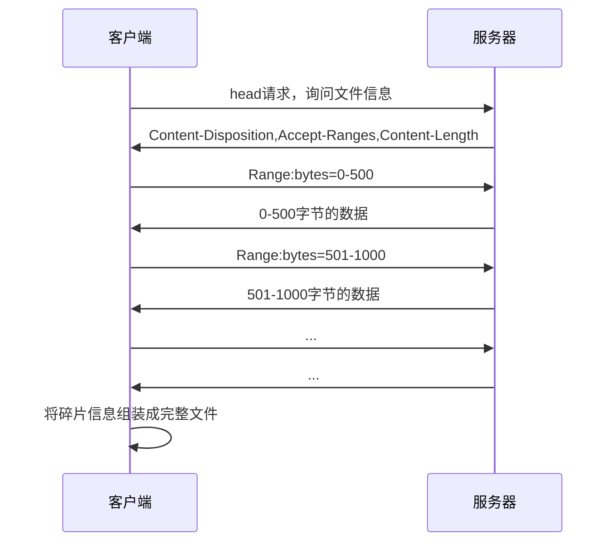
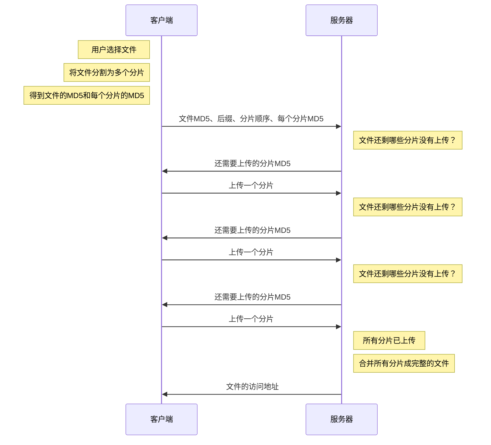

# 汇总
## HTML

#### 文档声明

###### 文档声明定义

```html
<!DOCTYPE html>
```

必须在第一行、顶格，对大小写不敏感

写在之前的内容，会令 IE9 及更早的浏览器触发**怪异模式**

###### ML

markup language（标记语言）

html 4.01 基于 SGML（Standard Generalized Markup Language），需要声明 DTD。html5 不基于 SGML，所以不需要引用 DTD。

html 是 SGML 的一个应用，xml 是简化了 SGML 并用来取代 SGML 的，xhtml 就是 html 从 SGML 专用 xml 语法的结果。


###### DTD

DTD（Document Type Definition），一种用于定义 XML 文档结构的规范

###### 为什么 HTML5 的文档声明不需要引入 DTD

HTML5 不再基于 SGML，所以不用再引入 DTD 声明，但是需要 DOCTYPE 来规范浏览器的行为

###### 什么是 H5

H5 = HTML5 + CSS3 +ES6

###### 渲染模式

通过开头的 DOCTYPE（文档声明）确定渲染模式

######## 怪癖模式（混杂模式）（Quirks mode）

为了与旧版本的 HTML 文档兼容而设计的

怪癖：

1. 宽高算法与 W3C 盒模型不同
2. 表格中字体样式不会继承
3. 可以设置行内元素的宽高

######## 严格模式（标准模式）（Standard mode）

遵循 HTML5 和现代 Web 标准

#### **语义化**

###### 语义元素

语义元素是指在 HTML（Hypertext Markup Language）中具有明确含义的元素，用于描述文档的结构和内容，以及提供更丰富的语义信息。这些元素不仅仅用于呈现页面的外观，还能够传达文档中各个部分的含义和关系，从而使文档更具可读性、可访问性和可维护性。

1. `<header>`：定义文档或节的页眉，通常包含标题、标语、导航等信息。
2. `<nav>`：定义导航链接的容器，用于包含页面的导航部分。
3. `<article>`：定义独立的、可独自分配的内容块，如一篇文章、一则新闻等。
4. `<section>`：定义文档中的一个节，可以包含若干相关的内容。
5. `<aside>`：定义与页面内容相关的、但可以独立存在的部分，通常表示侧边栏或附属信息。
6. `<footer>`：定义文档或节的页脚，通常包含版权信息、联系方式等。
7. `<main>`：定义文档的主要内容，用于标识页面的主要部分。
8. `<figure>`：用于包裹一些与文档主要流程相关的内容，如图表、图片、代码等

###### 为什么需要语义化

1. 有利于 SEO（Search Engine Optimization）：爬虫依赖标签确定关键字权重，语义化标签可以帮助爬虫爬取更多有效信息

2. 便于开发和维护
3. 方便其他设备解析：如屏幕阅读器、盲人阅读器、移动设备等

#### W3C

万维网联盟（World Wide Web Consortium）,是一个会员组织，成员包括一些知名的企业和高校

是一个推出标准的组织，最重要的工作室发展 web 规范。

有了网页标准可以降低开发难度和开发成本，减少各种 bug、安全问题。

#### SEO

###### 定义

搜索引擎优化，Search Engine Optimization。

###### 内部优化

1. **TDK**

   title、description、keywords

2. **语义化标签**

3. **非装饰图片加上 alt**

4. **谨慎使用 display: none**

5. **重要的 HTML 代码放在前面**

6. **少使用 iframe，iframe 不会被搜索引擎抓取**

###### 外部优化

放置友情链接和外链，提高网站权重

向各大搜索引擎登录入口提交网站

#### 微格式

"微格式"（Microformats）是一种在 HTML 文档中嵌入语义信息的技术，以便更容易地从 Web 页面中提取和理解数据。微格式提供了一种轻量级的标记方法，用于表示文档中的特定类型的信息，如联系信息、事件、人物等。

1. 提高人机可读性
2. 方便对内容进行操作，如访问、校对、转为其他格式

#### 可替换元素

展现效果不由 css 控制的元素，独立于 CSS

如,img,iframe,音视频标签等

img 内容由图片的地址决定，尽管能通过 css 设置宽高等信息，但是无法控制图片本身的内容

#### 页面可见性

简单的说，**浏览器标签页被隐藏或显示的时候会触发`visibilitychange`事件。**

用途

- 网站有图片轮播效果，只有在用户观看轮播的时候，才会自动展示下一显示信息。
- 仪表盘的应用程序不希望在页面不可见时轮询服务器进行更新。
- 页面想要检测是否正在渲染，以便可以准确的计算网页浏览量
- 当设备进入待机模式时，网站想要关闭设备声音（用户按下电源键关闭屏幕）
- 可应用于视频站点，当用户进入页面播放，离开页面暂停。
- 可应用于登录同步
- 可用于计算在线时长。
- 在线聊天离开状态。
- 还有一些切换效果，比方说，每次用户切换到你这个页面上的时候，logo 抖一下，或页面一道亮光闪过，或者其他效果

#### meta

`<meta>` 元素提供有关页面的元信息，

- 放在文档的头部
- 不包含内容
- 属性定义了与文档相关的键值对
- 不会显示在页面上，但对于机器是可读的

通常情况下，meta 元素被用于规定页面的描述、关键字、文档的作者、最后修改时间等，也会包含 header 头中的一部分信息

## CSS

#### 单位

###### 绝对单位

绝对长度单位是固定的，用任何一个绝对长度表示的长度都将恰好显示为这个尺寸


###### 相对单位

相对长度单位规定相对于另一个长度属性的长度


#### 浮动

######## 特性

1. 脱离文档流

2. 浮动元素互相贴靠
3. 宽度收缩

######## 清除浮动

clear 属性可以清除其他元素浮动对自身的影响

开启 BFC

#### BFC

`Block Formatting Context`， 名为 "块级格式化上下文"。`BFC`是一个完全独立的空间（布局环境），让空间里的子元素不会影响到外面的布局。

###### 使用方法

overflow: auto,scroll,hidden

position: absolute\fixed

display: inner-block

###### 作用

- 清除浮动导致的高度塌陷
- 清除浮动导致的元素遮挡
- 清除外边距重合

#### 属性计算

每一个元素都有所有的属性，每一个属性都会通过一系列的计算过程得到最终的值。

一个元素从什么css属性都没有到什么ccs属性都有的过程

###### 步骤

1. 确定声明值

   参考样式表中没有冲突的声明，作为 css 属性值

2. 层叠冲突

   对样式表有冲突的声明使用层叠规则，确定 css 属性值

3. 使用继承

   对仍然没有值的属性，若可以继承则继承父元素的值

4. 使用默认值

   对仍没有值的属性，全部使用默认属性值

###### 层叠规则

1. 重要性
   1. import 用户样式表
   2. import浏览器样式表
   3. 用户样式表
   4. 浏览器样式表

2. 特殊性

   计算css选择器的权重

3. 源代码次序

#### import

```css
@import "./index.css";
```

1. link 属于 HTML 标签，而@import 完全是 CSS 提供的方式
2. 加载顺序。使用 import 只有前一个 css 下载并解析之后才能引入后一个 css
3. 兼容性。老浏览器不支持@import
4. 使用 JS 控制 DOM 改变样式的时候只能使用 link,@import 不是 DOM 可以控制的

link 比 import 更好

#### 媒体查询

1. _link_ 方法

_link_ 方法引入媒体类型其实就是在 _link_ 标签引用样式的时候，通过 _link_ 标签中的 _media_ 属性来指定不同的媒体类型，如下：

```html
<link rel="stylesheet" href="index.css" media="screen" />
<link rel="stylesheet" href="print.css" media="print" />
```

2. _xml_ 方式

_xml_ 方式和 _link_ 方式比较相似，也是通过 _media_ 属性来指定，如下：

```xml
<? xml-stylesheet rel="stylesheet" media="screen" href="style.css" ?>
```

3. _@import_

_@import_ 引入媒体类型主要有两种方式，一种是在 CSS 样式表中通过 _@import_ 调用另一个样式文件，另外一种是在 _style_ 标签中引入。

> 注意：_IE6_ 和 _IE7_ 中不支持该方式

在样式文件中引入媒体类型：

```css
@import url("./index.css") screen;
```

在 _style_ 标签中引入媒体类型：

```html
<style>
  @import url("./index.css") screen;
</style>
```

4. _@meida_ 的方式

_@media_ 是 _CSS3_ 中新引进的一个特性，称为媒体查询。_@media_ 引入媒体也有两种方式，如下：

在样式文件中引入媒体类型：

```css
@media screen {
  /* 具体样式 */
}
```

在 _style_ 标签中引入媒体类型：

```html
<style>
  @media screen {
    /* 具体样式 */
  }
</style>
```

最常见是第 _1_ 种和第 _4_ 种

```css
@media 媒体类型 and (媒体特性) {
  /* 具体样式 */
}
```


#### 渐进增强和优雅降级

渐进增强，英语全称 _progressive enhancement_，指的是针对低版本浏览器进行构建页面，保证最基本的功能，然后再针对高级浏览器进行效果、交互等改进和追加功能达到更好的用户体验。

优雅降级，英语全称 _graceful degradation_，一开始就构建完整的功能，然后再针对低版本浏览器进行兼容。

```css
.transition {
  /*渐进增强写法*/
  -webkit-transition: all 0.5s;
  -moz-transition: all 0.5s;
  -o-transition: all 0.5s;
  transition: all 0.5s;
}
.transition {
  /*优雅降级写法*/
  transition: all 0.5s;
  -o-transition: all 0.5s;
  -moz-transition: all 0.5s;
  -webkit-transition: all 0.5s;
}
```

#### 渐进性渲染（惰性渲染）

指为了提高用户感知的加载速度，以尽快的速度来呈现页面的技术

1. 骨架屏
2. 图片占位符
3. 拆分网页资源

#### 层叠上下文

层叠上下文是 CSS 中一个重要的**概念**，用于控制元素在三维空间中的层叠顺序。 在 Web 页面中，元素可以在不同的层叠上下文中，每个层叠上下文都可以独立地确定其子元素的层叠顺序。 每个层叠上下文都有自己的层叠顺序，不同层叠上下文之间的元素堆叠顺序互不影响。层叠上下文可以包含在其他层叠上下文中，并且一起创建一个层叠上下文的层级。**每个层叠上下文都是自包含的，当一个元素的内容发生层叠后，该元素将被作为整体在父级层叠上下文中按顺序进行层叠。**

- 层叠上下文的层级是 HTML 元素层级的一个子级，因为只有某些元素才会创建层叠上下文
- 层叠上下文可以包含在其他层叠上下文中，并且一起创建一个层叠上下文的层级
- 每个层叠上下文都完全独立于它的兄弟元素，当处理层叠时只考虑其子元素。
- 每个层叠上下文都是自包含的：当一个元素的内容发生层叠后，该元素将被作为整体在父级层叠上下文中按顺序进行层叠。

###### 层叠等级和层叠顺序

**层叠等级**：该层叠上下文中的层叠上下文元素在`Z轴`上的上下顺序

**层叠顺序**：表示元素发生层叠时按照特定的顺序规则在`Z轴`上垂直显示，如下图

**由此可见，前面所说的“层叠上下文”和“层叠等级”是一种概念，而这里的“层叠顺序”是一种规则**


###### 总结

层叠上下文是一个三维的概念，控制元素在三维空间中的层叠顺序

每个层叠上下文中的元素都具有层叠等级，并且遵循一定的层叠顺序进行层叠

层叠上下文可以包含在其他层叠上下文中，并且层叠上下文是自包含的，当一个元素的内容发生层叠后，该元素将被作为整体进行层叠

###### 触发层叠上下文的方式

1. position（非 static）+z-index
2. 父元素 display: flex;,子元素 z-index 不为 auto，子元素变为层叠上下文元素
3. opacity 属性不为 1
4. transform 不为 none

###### 注意

1. 层叠上下文父元素必在最底层，就算子元素 zindex 为负值也是一样，可以从层叠顺序图中看出

2. 当只设置 position 而不设置 zindex，元素是非层叠上下文，但是 zindex 默认为 auto，从层叠顺序图中可以看出，在块状盒子层级上面

3. 若父元素不是层叠上下文：

   子元素是层叠上下文：会寻找上级层叠上下文

   子元素不是层叠上下文：跟随父元素层叠


## JS

#### let、var、const

在 _JavaScript_ 中，一共存在 _3_ 种声明变量的方式：

- _var_
- _let_
- _const_

之所以有 _3_ 种方式，这是由于历史原因造成的。最初声明变量的关键字就是 _var_，但是为了解决作用域的问题，所以后面新增了 _let_ 和 _const_ 的方式。

###### _var_ 关键字

1. 没有块级作用域的概念
2. 有全局作用域、函数作用域的概念
3. 不初始化值默认为 _undefined_
4. 存在变量提升
5. 全局作用域用 _var_ 声明的变量会挂载到 _window_ 对象下
6. 同一作用域中允许重复声明

###### _let_ 关键字

1. 有块级作用域的概念
2. 不存在变量提升
3. 暂时性死区
4. 同一块作用域中不允许重复声明

###### _const_ 关键字

1. 与 _let_ 特性一样，仅有 _2_ 个差别
2. 区别 1：必须立即初始化，不能留到以后赋值
3. 区别 2：常量的值不能改变

#### 值和引用

在 _JavaScript_ 中，数据类型整体上来讲可以分为两大类：**基本类型**和**引用数据类型**

基本数据类型，一共有 _6_ 种：

```text
string，symbol，number，boolean，undefined，null
```

其中 _symbol_ 类型是在 _ES6_ 里面新添加的基本数据类型。

引用数据类型，就只有 _1_ 种：

```js
object;
```

基本数据类型的值又被称之为**原始值或简单值**，而引用数据类型的值又被称之为**复杂值或引用值**。

######## 简单值（原始值）

**简单值是表示 _JavaScript_ 中可用的数据或信息的最底层形式或最简单形式。**简单类型的值被称为简单值，是因为它们是**不可细化**的。

也就是说，数字是数字，字符串是字符串，布尔值是 _true_ 或 _false_，_null_ 和 _undefined_ 就是 _null_ 和 _undefined_。这些值本身很简单，不能够再进行拆分。

由于简单值的数据大小是固定的，所以**简单值的数据是存储于内存中的栈区里面的。**

要简单理解栈的存取方式，我们可以通过类比乒乓球盒子来分析。如下图：


下面是具体的代码示例：

```js
var str = "Hello World";
var num = 10;
var bol = true;
var myNull = null;
var undef = undefined;
console.log(typeof str); // string
console.log(typeof num); // number
console.log(typeof bol); // boolean
console.log(typeof myNull); // object
console.log(typeof undef); // undefined
```

这里面 _null_ 比较特殊，打印出来是 _object_，这是由于历史原因所遗留下来的问题。

是来源于 _JavaScript_ 从第一个版本开始时的一个 _bug_，并且这个 _bug_ 无法被修复。因为修复会破坏现有的代码。

**具体原因是因为不同的对象在底层都表现为二进制，在 _JavaScript_ 中二进制前三位都为 _0_ 的话会被判断为 _object_ 类型，_null_ 的二进制全部为 _0_，自然前三位也是 _0_，所以执行 _typeof_ 值会返回 _object_。**

例外，当我们打印 _null == undefined_ 的时候，返回的是 _true_，这也是面试时经常会被问到的一个问题。

这两个值都表示“无”的意思。

通常情况下， 当我们试图访问某个不存在的或者没有赋值的变量时，就会得到一个 _undefined_ 值。_Javascript_ 会自动将声明是没有进行初始化的变量设为 _undifined_。

而 _null_ 值表示空，_null_ 不能通过 _Javascript_ 来自动赋值，也就是说必须要我们自己手动来给某个变量赋值为 _null_。

那么为什么 _JavaScript_ 要设置两个表示"无"的值呢？

这其实也是因为历史原因。

_1995_ 年 _JavaScript_ 诞生时，最初像 _Java_ 一样，只设置了 _null_ 作为表示"无"的值。根据 _C_ 语言的传统，_null_ 被设计成可以自动转为 _0_。

但是，_JavaScript_ 的设计者，觉得这样做还不够，主要有以下两个原因。

1. _null_ 像在 _Java_ 里一样，被当成一个对象。但是，_JavaScript_ 的数据类型分成原始类型（_primitive_）和复合类型（_complex_）两大类，作者觉得表示“无”的值最好不是对象。
2. _JavaScript_ 的最初版本没有包括错误处理机制，发生数据类型不匹配时，往往是自动转换类型或者默默地失败。作者觉得，如果 _null_ 自动转为 _0_，很不容易发现错误。

因此，作者又设计了一个 _undefined_。**这里注意：先有 _null_ 后有 _undefined_ 出来，_undefined_ 是为了填补之前的坑。**

_JavaScript_ 的最初版本是这样区分的：

_null_ 是一个表示“无”的对象（空对象指针），转为数值时为 _0_；

典型用法是：

- 作为函数的参数，表示该函数的参数不是对象。

- 作为对象原型链的终点。

_undefined_ 是一个表示"无"的原始值，转为数值时为 _NaN_。

典型用法是：

- 变量被声明了，但没有赋值时，就等于 _undefined_。
- 调用函数时，应该提供的参数没有提供，该参数等于 _undefined_。
- 对象没有赋值的属性，该属性的值为 _undefined_。
- 函数没有返回值时，默认返回 _undefined_。

######## 复杂值（引用值）

在 _JavaScript_ 中，对象就是一个复杂值。因为对象可以向下拆分，拆分成多个简单值或者复杂值。

**复杂值在内存中的大小是未知的，因为复杂值可以包含任何值，而不是一个特定的已知值，所以复杂值的数据都是存储于堆区里面。**

如下图所示：


下面是具体的代码示例：

```js
// 简单值
var a1 = 0;
var a2 = "this is str";
var a3 = null;

// 复杂值
var c = [1, 2, 3];
var d = { m: 20 };
```

#### 包装类型

包装对象，就是当基本类型以对象的方式去使用时，_JavaScript_ 会转换成对应的包装类型，相当于 _new_ 一个对象，内容和基本类型的内容一样，然后当操作完成再去访问的时候，这个临时对象会被销毁，然后再访问时候就是 _undefined_。

_number、string、boolean_ 都有对应的包装类型。

因为有了基本包装类型，所以 _JavaScript_ 中的基本类型值可以被当作对象来访问。

基本类型特征：

1. 每个包装类型都映射到同名的基本类型
2. 在读取模式下访问基本类型值时，就会创建对应的基本包装类型的一个对象，从而方便了数据操作
3. 操作基本类型值的语句一经执行完毕，就会立即销毁新创建的包装对象

用代码的方式解释就是如下：

```js
//我们平常写程序的过程：
var str = 'hello'; // string 基本类型
var s2 = str.charAt(0); // 在执行到这一句的时候 后台会自动完成以下动作 ：
(
    var _str = new String('hello'); // 1 找到对应的包装对象类型，然后通过包装对象创建出一个和基本类型值相同的对象
    var s2 = _str.charAt(0); // 2 然后这个对象就可以调用包装对象下的方法，并且返回结给 s2.
    _str = null;  //    3 之后这个临时创建的对象就被销毁了， str =null;
)
console.log(s2); // h
console.log(str); // hello
```

#### 数据类型显式转换

_JavaScript_ 是一种动态类型语言，变量没有类型限制，可以随时赋予任意值。

###### Number

可以使用`Number()、parseInt()、parseFloat()`

######## 原始类型转换

- 转换时会过滤前后的空白字符串

- 不能转换的会变为 NAN

- null 会转为 0，undefine 转为 NAN

- “123abc”Number()得到 NAN，parseInt 得到 123，但“abc123”都是 NAN

  ```js
  // 数值：转换后还是原来的值
  Number(324); // 324
  
  // 字符串：如果可以被解析为数值，则转换为相应的数值
  Number("324"); // 324
  
  // 字符串：如果不可以被解析为数值，返回 NaN
  Number("324abc"); // NaN
  
  // 空字符串转为0
  Number(""); // 0
  
  // 布尔值：true 转成 1，false 转成 0
  Number(true); // 1
  Number(false); // 0
  
  // undefined：转成 NaN
  Number(undefined); // NaN
  
  // null：转成0
  Number(null); // 0
  ```

######## 对象转换

1. 调用对象自身的`valueOf`方法。如果返回原始类型的值，则直接对该值使用`Number`函数，不再进行后续步骤。

2. 如果`valueOf`方法返回的还是对象，则改为调用对象自身的`toString`方法。如果`toString`方法返回原始类型的值，则对该值使用`Number`函数，不再进行后续步骤。

3. 如果`toString`方法返回的是对象，就报错。

```js
var obj = { x: 1 };
Number(obj); // NaN

// 等同于
if (typeof obj.valueOf() === "object") {
  Number(obj.toString());
} else {
  Number(obj.valueOf());
}
```

```js
Number({ a: 1 }); // NaN
Number([1, 2, 3]); // NaN
Number([5]); // 5
```

###### String

可以使用`String()、toString()`

######## 原始类型

```js
String(123); // "123"
String("abc"); // "abc"
String(true); // "true"
String(undefined); // "undefined"
String(null); // "null"
```

######## 对象

1. 先调用对象自身的`toString`方法。如果返回原始类型的值，则对该值使用`String`函数，不再进行以下步骤。
2. 如果`toString`方法返回的是对象，再调用原对象的`valueOf`方法。如果`valueOf`方法返回原始类型的值，则对该值使用`String`函数，不再进行以下步骤。
3. 如果`valueOf`方法返回的是对象，就报错。

```js
String({ a: 1 });
// "[object Object]"

// 等同于
String({ a: 1 }.toString());
// "[object Object]"
```

###### Boolean

可以使用`Boolean()`

它的转换规则相对简单：除了以下五个值的转换结果为`false`，其他的值全部为`true`。

- `undefined`
- `null`
- `0`（包含`-0`和`+0`）
- `NaN`
- `''`（空字符串）

```js
Boolean(undefined); // false
Boolean(null); // false
Boolean(0); // false
Boolean(NaN); // false
Boolean(""); // false
```

当然，`true`和`false`这两个布尔值不会发生变化。

```js
Boolean(true); // true
Boolean(false); // false
```

**注意，所有对象（包括空对象）的转换结果都是`true`，甚至连`false`对应的布尔对象`new Boolean(false)`也是`true`（详见《原始类型值的包装对象》一章）。**

```js
Boolean({}); // true
Boolean([]); // true
Boolean(new Boolean(false)); // true
```

#### 数据类型隐式转换

遇到以下三种情况时，JavaScript 会自动转换数据类型，即转换是自动完成的，用户不可见。

1. 不同类型的数据互相运算

```javascript
123 + "abc"; // "123abc"
```

2. 对非布尔值类型的数据求布尔值

```javascript
if ("abc") {
  console.log("hello");
} // "hello"
```

3. 对非数值类型的值使用一元运算符（即`+`和`-`）

```javascript
+{ foo: "bar" } - [1, 2, 3]; // NaN // NaN
```

**自动转换的规则是这样的：预期什么类型的值，就调用该类型的转换函数。比如，某个位置预期为字符串，就调用`String()`函数进行转换。如果该位置既可以是字符串，也可能是数值，那么默认转为数值**

#### 运算符

###### 加法运算符

**（1）基本规则**

加法运算符是在运行时决定，到底是执行相加，还是执行连接。也就是说，运算子的不同，导致了不同的语法行为，这种现象称为“重载”（overload）。由于加法运算符存在重载，可能执行两种运算，使用的时候必须很小心。

```js
"3" + 4 + 5; // "345"
3 + 4 + "5"; // "75"
```

上面代码中，由于从左到右的运算次序，字符串的位置不同会导致不同的结果。

除了加法运算符，其他算术运算符（比如减法、除法和乘法）都不会发生重载。它们的规则是：所有运算子一律转为数值，再进行相应的数学运算。

```js
1 - "2"; // -1
1 * "2"; // 2
1 / "2"; // 0.5
```

上面代码中，减法、除法和乘法运算符，都是将字符串自动转为数值，然后再运算。

如果一个运算子是字符串，另一个运算子是非字符串，这时非字符串会转成字符串，再连接在一起

**（2）对象相加**

1. 先`valueOf`
2. 再`toString`(和显式转为 Number 规则顺序一样)

这里有一个特例，如果运算子是一个`Date`对象的实例，那么会优先执行`toString`方法。

```javascript
var obj = new Date();
obj.valueOf = function () {
  return 1;
};
obj.toString = function () {
  return "hello";
};

obj + 2; // "hello2"
```

上面代码中，对象`obj`是一个`Date`对象的实例，并且自定义了`valueOf`方法和`toString`方法，结果`toString`方法优先执行。

###### 余数运算符

余数运算符（`%`）返回前一个运算子被后一个运算子除，所得的余数。

```javascript
12 % 5; // 2
```

需要注意的是，运算结果的正负号由第一个运算子的正负号决定。

```javascript
-1 % 2; // -1
1 % -2; // 1
```

所以，为了得到负数的正确余数值，可以先使用绝对值函数。

```javascript
// 错误的写法
function isOdd(n) {
  return n % 2 === 1;
}
isOdd(-5); // false
isOdd(-4); // false

// 正确的写法
function isOdd(n) {
  return Math.abs(n % 2) === 1;
}
isOdd(-5); // true
isOdd(-4); // false
```

余数运算符还可以用于浮点数的运算。但是，由于浮点数不是精确的值，无法得到完全准确的结果。

```javascript
6.5 % 2.1;
// 0.19999999999999973
```

######## 指数运算符

指数运算符（`**`）完成指数运算，前一个运算子是底数，后一个运算子是指数。

```javascript
2 ** 4; // 16
```

注意，指数运算符是右结合，而不是左结合。即多个指数运算符连用时，先进行最右边的计算。

```javascript
// 相当于 2 ** (3 ** 2)
2 ** (3 ** 2);
// 512
```

上面代码中，由于指数运算符是右结合，所以先计算第二个指数运算符，而不是第一个。

###### 比较运算符

> 注意，比较运算符可以比较各种类型的值，不仅仅是数值。

JavaScript 一共提供了 8 个比较运算符。

- `>` 大于运算符
- `<` 小于运算符
- `<=` 小于或等于运算符
- `>=` 大于或等于运算符
- `==` 相等运算符
- `===` 严格相等运算符
- `!=` 不相等运算符
- `!==` 严格不相等运算符

这八个比较运算符分成两类：相等比较和非相等比较。两者的规则是不一样的，对于非相等的比较，算法是先看两个运算子是否都是字符串，如果是的，就按照字典顺序比较（实际上是比较 Unicode 码点）；否则，将两个运算子都转成数值，再比较数值的大小。

######## 非相等运算符：字符串的比较

字符串按照字典顺序进行比较。

```
'cat' > 'dog' // false
'cat' > 'catalog' // false
```

JavaScript 引擎内部首先比较首字符的 Unicode 码点。如果相等，再比较第二个字符的 Unicode 码点，以此类推。

```
'cat' > 'Cat' // true'
```

上面代码中，小写的`c`的 Unicode 码点（`99`）大于大写的`C`的 Unicode 码点（`67`），所以返回`true`。

由于所有字符都有 Unicode 码点，因此汉字也可以比较。

```
'大' > '小' // false
```

上面代码中，“大”的 Unicode 码点是 22823，“小”是 23567，因此返回`false`。

######## 非相等运算符：非字符串的比较

如果两个运算子之中，至少有一个不是字符串，需要分成以下两种情况。

**（1）原始类型值**

如果两个运算子都是原始类型的值，则是先转成数值再比较。

```javascript
5 > "4"; // true
// 等同于 5 > Number('4')
// 即 5 > 4

true > false; // true
// 等同于 Number(true) > Number(false)
// 即 1 > 0

2 > true; // true
// 等同于 2 > Number(true)
// 即 2 > 1
```

上面代码中，字符串和布尔值都会先转成数值，再进行比较。

这里需要注意与`NaN`的比较。任何值（包括`NaN`本身）与`NaN`使用非相等运算符进行比较，返回的都是`false`。

```javascript
1 > NaN; // false
1 <= NaN; // false
"1" > NaN; // false
"1" <= NaN; // false
NaN > NaN; // false
NaN <= NaN; // false
```

**（2）对象**

如果运算子是对象，会转为原始类型的值，再进行比较。

对象转换成原始类型的值，算法是先调用`valueOf`方法；如果返回的还是对象，再接着调用`toString`方法，详细解释参见《数据类型的转换》一章。

```javascript
var x = [2];
x > "11"; // true
// 等同于 [2].valueOf().toString() > '11'
// 即 '2' > '11'

x.valueOf = function () {
  return "1";
};
x > "11"; // false
// 等同于 [2].valueOf() > '11'
// 即 '1' > '11'
```

两个对象之间的比较也是如此。

```javascript
[2] > [1] // true
// 等同于 [2].valueOf().toString() > [1].valueOf().toString()
// 即 '2' > '1'

[2] > [11] // true
// 等同于 [2].valueOf().toString() > [11].valueOf().toString()
// 即 '2' > '11'

{ x: 2 } >= { x: 1 } // true
// 等同于 { x: 2 }.valueOf().toString() >= { x: 1 }.valueOf().toString()
// 即 '[object Object]' >= '[object Object]'
```

######## 相等运算符

相等运算符用来比较相同类型的数据时，与严格相等运算符完全一样。

```js
1 == 1.0;
// 等同于
1 === 1.0;
```

比较不同类型的数据时，相等运算符会先将数据进行类型转换，然后再用严格相等运算符比较。下面分成几种情况，讨论不同类型的值互相比较的规则。

**（1）原始类型值**

原始类型的值会转换成数值再进行比较。

```js
1 == true; // true
// 等同于 1 === Number(true)

0 == false; // true
// 等同于 0 === Number(false)

2 == true; // false
// 等同于 2 === Number(true)

2 == false; // false
// 等同于 2 === Number(false)

"true" == true; // false
// 等同于 Number('true') === Number(true)
// 等同于 NaN === 1

"" == 0; // true
// 等同于 Number('') === 0
// 等同于 0 === 0

"" == false; // true
// 等同于 Number('') === Number(false)
// 等同于 0 === 0

"1" == true; // true
// 等同于 Number('1') === Number(true)
// 等同于 1 === 1

"\n  123  \t" == 123; // true
// 因为字符串转为数字时，省略前置和后置的空格
```

上面代码将字符串和布尔值都转为数值，然后再进行比较。

**（2）对象与原始类型值比较**

对象（这里指广义的对象，包括数组和函数）与原始类型的值比较时，对象转换成原始类型的值，再进行比较。

具体来说，先调用对象的`valueOf()`方法，如果得到原始类型的值，就按照上一小节的规则，互相比较；如果得到的还是对象，则再调用`toString()`方法，得到字符串形式，再进行比较。

下面是数组与原始类型值比较的例子。

```
// 数组与数值的比较
[1] == 1 // true

// 数组与字符串的比较
[1] == '1' // true
[1, 2] == '1,2' // true

// 对象与布尔值的比较
[1] == true // true
[2] == true // false
```

上面例子中，JavaScript 引擎会先对数组`[1]`调用数组的`valueOf()`方法，由于返回的还是一个数组，所以会接着调用数组的`toString()`方法，得到字符串形式，再按照上一小节的规则进行比较。

下面是一个更直接的例子。

```js
const obj = {
  valueOf: function () {
    console.log("执行 valueOf()");
    return obj;
  },
  toString: function () {
    console.log("执行 toString()");
    return "foo";
  },
};

obj == "foo";
// 执行 valueOf()
// 执行 toString()
// true
```

上面例子中，`obj`是一个自定义了`valueOf()`和`toString()`方法的对象。这个对象与字符串`'foo'`进行比较时，会依次调用`valueOf()`和`toString()`方法，最后返回`'foo'`，所以比较结果是`true`。

**（3）undefined 和 null**

`undefined`和`null`只有与自身比较，或者互相比较时，才会返回`true`；与其他类型的值比较时，结果都为`false`。

```js
undefined == undefined; // true
null == null; // true
undefined == null; // true

false == null; // false
false == undefined; // false

0 == null; // false
0 == undefined; // false
```

**（4）相等运算符的缺点**

相等运算符隐藏的类型转换，会带来一些违反直觉的结果。

```js
0 == ""; // true
0 == "0"; // true

2 == true; // false
2 == false; // false

false == "false"; // false
false == "0"; // true

false == undefined; // false
false == null; // false
null == undefined; // true

" \t\r\n " == 0; // true
```

上面这些表达式都不同于直觉，很容易出错。因此建议不要使用相等运算符（`==`），最好只使用严格相等运算符（`===`）。

#### 原型和原型链

**说一说你对 _JavaScript_ 中原型与原型链的理解？**

- 每个对象都有一个 \_\__proto_\_\_ 属性，该属性指向自己的原型对象
- 每个构造函数都有一个 _prototype_ 属性，该属性指向实例对象的原型对象
- 原型对象里的 _constructor_ 指向构造函数本身

如下图：


每个对象都有自己的原型对象，而原型对象本身，也有自己的原型对象，从而形成了一条原型链条。

当试图访问一个对象的属性时，它不仅仅在该对象上搜寻，还会搜寻该对象的原型，以及该对象的原型的原型，依次层层向上搜索，直到找到一个名字匹配的属性或到达原型链的末尾。

**对一个构造函数实例化后，它的原型链指向什么？**

参考答案：

指向该构造函数实例化出来对象的原型对象。

对于构造函数来讲，可以通过 _prototype_ 访问到该对象。

对于实例对象来讲，可以通过隐式属性 \_\__proto_\_\_ 来访问到。

#### 执行上下文

js代码运行前需要一个环境，执行上下文就是在内存中创建一块空间，提供运行所需的数据。

**_JavaScript_ 中执**

**行环境**

1. 全局环境
2. 函数环境
3. _eval_ 函数环境 （已不推荐使用）

那么与之对应的执行上下文类型同样有 _3_ 种：

1. 全局执行上下文
2. 函数执行上下文
3. _eval_ 函数执行上下文

###### **执行栈（函数调用栈）**

程序执行进入一个执行环境时，它的执行上下文就会被创建，并被推入执行栈中（入栈）；程序执行完成时，它的执行上下文就会被销毁，并从栈顶被推出（出栈），控制权交由下一个执行上下文。

因为 _JavaScript_ 在执行代码时最先进入全局环境，所以**处于栈底的永远是全局环境的执行上下文**。而处于**栈顶的是当前正在执行函数的执行上下文**。

当函数调用完成后，它就会从栈顶被推出，理想的情况下，闭包会阻止该操作，闭包可以参阅《闭包》章节。

而全局环境只有一个，对应的全局执行上下文也只有一个，只有当页面被关闭之后它才会从执行栈中被推出，否则一直存在于栈底。

下面我们来看一段具体的代码示例：

```js
function foo() {
  function bar() {
    return "I am bar";
  }
  return bar();
}
foo();
```

对应图解如下：

**执行上下文的数量限制（堆栈溢出）**

执行上下文可存在多个，虽然没有明确的数量限制，但如果超出栈分配的空间，会造成堆栈溢出。常见于递归调用，没有终止条件造成死循环的场景。

```js
// 递归调用自身
function foo() {
  foo();
}
foo();
// 报错： Uncaught RangeError: Maximum call stack size exceeded
```

###### 执行上下文生命周期

前面我们有说到，运行 _JavaScript_ 代码时，当代码执行进入一个环境时，就会为该环境创建一个执行上下文，它会在你运行代码前做一些准备工作。接下来我们就来看一下具体会做哪些准备工作。

具体要做的事，和执行上下文的生命周期有关。

执行上下文的生命周期有两个阶段：

1. 创建阶段（**进入**执行上下文）：**函数被调用时**，进入函数环境，为其创建一个执行上下文，此时进入创建阶段。
2. 执行阶段（代码**执行**）：执行函数中代码时，此时执行上下文进入执行阶段。

**创建阶段**

创建阶段要做的事情主要如下：

1. 创建变量对象（_VO：variable object_）

   - 确定函数的形参（**并赋值**）

   - 函数环境会初始化创建 *Arguments*对象（**并赋值**）
   - 确定普通字面量形式的函数声明（**并赋值**）
   - 变量声明，函数表达式声明（**未赋值**）

2. 确定 _this_ 指向（**_this_ 由调用者确定**）

3. 确定作用域（**词法环境决定，哪里声明定义，就在哪里确定**）

**执行阶段**

1. 变量对象赋值
   - 变量赋值
   - 函数表达式赋值
2. 调用函数
3. 顺序执行其它代码

> **什么是执行上下文？**
>
> 简而言之，执行上下文是评估和执行 _JavaScript_ 代码的环境的抽象概念。每当 _Javascript_ 代码在运行的时候，它都是在执行上下文中运行。
>
> **执行上下文的类型**
>
> _JavaScript_ 中有三种执行上下文类型。
>
> - **全局执行上下文：**这是默认或者说基础的上下文，任何不在函数内部的代码都在全局上下文中。它会执行两件事，创建一个全局的 _window_ 对象（浏览器的情况下），并且设置 _this_ 的值等于这个全局对象。一个程序中只会有一个全局执行上下文。
> - **函数执行上下文：**每当一个函数被调用时, 都会为该函数创建一个新的上下文。每个函数都有它自己的执行上下文，不过是在函数被调用时创建的。函数上下文可以有任意多个。每当一个新的执 行上下文被创建，它会按定义的顺序（将在后文讨论）执行一系列步骤。
> - **_Eval_ 函数执行上下文：**执行在 _eval_ 函数内部的代码也会有它属于自己的执行上下文。
>
> **调用栈**
>
> 调用栈是解析器（如浏览器中的的 _JavaScript_ 解析器）的一种机制，可以在脚本调用多个函数时，跟踪每个函数在完成执行时应该返回控制的点。（如什么函数正在执行，什么函数被这个函数调用，下一个调用的函数是谁）
>
> - 当脚本要调用一个函数时，解析器把该函数添加到栈中并且执行这个函数。
> - 任何被这个函数调用的函数会进一步添加到调用栈中，并且运行到它们被上个程序调用的位置。
> - 当函数运行结束后，解释器将它从堆栈中取出，并在主代码列表中继续执行代码。
> - 如果栈占用的空间比分配给它的空间还大，那么则会导致“栈溢出”错误。

#### 作用域

作用域，即变量和函数生效的区域或集合。换句话说，作用域决定了代码区块中变量和其他资源的可见性。

###### 作用域类型

1. **全局作用域**

在代码中任何地方都能访问到的对象拥有全局作用域，一般来说以下几种情形拥有全局作用域：

- **最外层函数**和**在最外层函数外面定义的变量**拥有全局作用域

```js
var outVariable = "我是最外层变量"; //最外层变量
function outFun() {
  //最外层函数
  var inVariable = "内层变量";
  function innerFun() {
    //内层函数
    console.log(inVariable);
  }
  innerFun();
}
console.log(outVariable); // 我是最外层变量
outFun(); // 内层变量
console.log(inVariable); // inVariable is not defined
innerFun(); // innerFun is not defined
```

- 所有未定义直接赋值的变量自动声明为拥有全局作用域

  ```js
  function outFun2() {
    variable = "未定义直接赋值的变量";
    var inVariable2 = "内层变量2";
  }
  outFun2(); //要先执行这个函数，否则根本不知道里面是啥
  console.log(variable); //未定义直接赋值的变量
  console.log(inVariable2); //inVariable2 is not define
  ```

- 所有 _window_ 对象的属性拥有全局作用域

2. **函数作用域**

函数作用域，是指声明在函数内部的变量，和全局作用域相反，局部作用域一般只在固定的代码片段内可访问到，最常见的例如函数内部。

```js
function doSomething() {
  var stuName = "zhangsan";
  function innerSay() {
    console.log(stuName);
  }
  innerSay();
}
console.log(stuName); // 脚本错误
innerSay(); // 脚本错误
```

3. **块级作用域**

   块级作用域可通过新增命令 _let_ 和 _const_ 声明，所声明的变量在指定块的作用域外无法被访问

###### 作用域链

######## 自由变量

当前作用域没有定义的变量，称为自由变量

```js
var a = 100;
function fn() {
  var b = 200;
  console.log(a); // 这里的 a 在这里就是一个自由变量
  console.log(b);
}
fn();
```

自由变量要到创建 _fn_ 函数的那个作用域中取，**无论 _fn_ 函数将在哪里调用**。

**要到创建这个函数的作用域中取值，这里强调的是“创建”，而不是“调用”**

######## 作用域链

作用域的集合就是作用域链

当访问一个变量时，编译器在执行这段代码时，会首先从当前的作用域中查找是否有这个标识符，如果没有找到，就会去父作用域查找，如果父作用域还没找到继续向上查找，直到全局作用域为止。

而作用域链，就是有当前作用域与上层作用域的一系列变量对象组成，它保证了当前执行的作用域对符合访问权限的变量和函数的有序访问。

作用域链有一个非常重要的特性，**那就是作用域中的值是在函数创建的时候，就已经被存储了，是静态的**。

所谓静态，就是说作用域中的值一旦被确定了，永远不会变。**函数可以永远不被调用，但是作用域中的值在函数创建的时候就已经被写入了，**并且存储在函数作用域链对象里面。

#### 作用域与执行上下文

- 作用域是在编写代码时定义的，是变量访问的规则
- 执行上下文是在代码执行时创建的，是一个包含了变量对象、作用域链等信息的环境
- 作用域和执行上下文密切相关，执行上下文的作用域链决定了变量的访问规则

#### this

###### JS

- 在函数体中，非显式或隐式地简单调用函数时，在严格模式下，函数内的 _this_ 会被绑定到 _undefined_ 上，在非严格模式下则会被绑定到全局对象 _window/global_ 上。

- 一般使用 _new_ 方法调用构造函数时，构造函数内的 _this_ 会被绑定到新创建的对象上。

- 一般通过 _call/apply/bind_ 方法显式调用函数时，函数体内的 _this_ 会被绑定到指定参数的对象上。

- 一般通过上下文对象调用函数时，函数体内的 _this_ 会被绑定到该对象上。

- 在箭头函数中，_this_ 的指向是由外层（函数或全局）作用域来决定的。

```js
const o1 = {
  text: "o1",
  fn: function () {
    return this.text;
  },
};

const o2 = {
  text: "o2",
  fn: function () {
    return o1.fn();
  },
};

const o3 = {
  text: "o3",
  fn: function () {
    var fn = o1.fn;
    return fn();
  },
};

console.log(o1.fn()); // o1
console.log(o2.fn()); // o1
console.log(o3.fn()); // undefined
```

###### DOM

_DOM_ 元素绑定事件时，事件处理函数里面的 _this_ 指向绑定了事件的元素

这个地方一定要注意它和 _target_ 的区别，_target_ 是指向触发事件的元素

###### 改变指向

_call、apply、bind_ 方法修改 _this_ 指向

方法没有参数，或者参数为 _null_ 或 _undefined_，则等同于指向全局对象。

传参是原始类型，则转化成对应的包装对象，然后传入方法

```js
Function.prototype.san = function () {
  return Function.prototype.call.bind(this);
};
console.log(Array.prototype.push.san()([], 1, 2));

var push = Function.prototype.call.bind(Array.prototype.push);
var pop = Function.prototype.call.bind(Array.prototype.pop);

var a = [1, 2, 3];
push(a, 4);
a; // [1, 2, 3, 4]

pop(a);
a; // [1, 2, 3]
```

###### 箭头函数

箭头函数体内的`this`对象，就是定义**该函数时所在的作用域指向的对象**，而不是使用时所在的作用域指向的对象

#### 垃圾回收

###### 内存泄漏

不再用到的内存，如果没有及时释放，就叫做内存泄漏（_memory leak_）

_JavaScript_ 具有自动垃圾回收机制。垃圾收集器会按照固定的时间间隔周期性的执行。

_JavaScript_ 常见的垃圾回收方式：**标记清除**、**引用计数**方式。

1、标记清除方式：

- 工作原理：当变量进入环境时，将这个变量标记为“进入环境”。当变量离开环境时，则将其标记为“离开环境”。标记“离开环境”的就回收内存。

- 工作流程：

- 垃圾回收器，在运行的时候会给存储在内存中的所有变量都加上标记；

- 去掉环境中的变量以及被环境中的变量引用的变量的标记；

- 被加上标记的会被视为准备删除的变量；

- 垃圾回收器完成内存清理工作，销毁那些带标记的值并回收他们所占用的内存空间。

2、引用计数方式：

- 工作原理：跟踪记录每个值被引用的次数。

- 工作流程：

- 声明了一个变量并将一个引用类型的值赋值给这个变量，这个引用类型值的引用次数就是 _1_；

- 同一个值又被赋值给另一个变量，这个引用类型值的引用次数加 _1_；

- 当包含这个引用类型值的变量又被赋值成另一个值了，那么这个引用类型值的引用次数减 _1_；

- 当引用次数变成 _0_ 时，说明没办法访问这个值了；

- 当垃圾收集器下一次运行时，它就会释放引用次数是 _0_ 的值所占的内存。

  循环引用 bug

#### 闭包

一个函数对周围状态的引用捆绑在一起，内层函数中访问到其外层函数的作用域

在 _JavaScript_ 中是通过作用域链来实现的闭包

使用闭包可以解决一个全局变量污染的问题。

而作用域链，正是实现闭包的手段。

- 通过闭包可以让外部环境访问到函数内部的局部变量。
- 通过闭包可以让局部变量持续保存下来，不随着它的上下文环境一起销毁。


闭包可能导致内存泄露

1. 持有了不再需要函数引用，可能导致函数关联的词法环境无法销毁，从而导致内存泄露
2. 当多个函数共享词法环境，可能导致词法环境膨胀


#### 事件注册

注册事件的方式常见的有 _3_ 种方式：

- _HTML_ 元素中注册的事件：这种方式又被称之为行内事件监听器。这是在浏览器中处理事件最原始的方法。

- _DOM0_ 级方式注册事件：这种方式是首先取到要为其绑定事件的元素节点对象，然后给这些节点对象的事件处理属性赋值一个函数。

- _DOM2_ 级方式注册事件：_DOM2_ 级通过 _addEventListener_ 方法来为一个 _DOM_ 元素添加多个事件处理函数。

  该方法接收 _3_ 个参数：事件名、事件处理函数、布尔值。

  如果这个布尔值为 _true_，则在捕获阶段处理事件，如果为 _false_，则在冒泡阶段处理事件。若最后的布尔值不填写，则和 _false_ 效果一样，也就是说默认为 _false_，在冒泡阶段进行事件的处理。

关于移除注册的事件，如果是 _DOM0_ 级方式注册的事件，直接将值设置为 _null_ 即可。如果是 _DOM2_ 级注册的事件，可以使用 _removeEventListener_ 方法来移除事件。

#### 属性描述符

属性描述符是 _ECMAScript_ 5 新增的语法，它其实就是一个**内部对象**，用来描述对象的属性的特性

属性描述符可选键一共有 _6_ 个

- _value_：设置属性值，默认值为 _undefined_。
- _writable_：设置属性值是否可写，默认值为 _true_。
- _enumerable_：设置属性是否可枚举，即是否允许使用 _for/in_ 语句或 _Object.keys( )_ 函数遍历访问，默认为 _true_。
- _configurable_：设置是否可设置属性特性，默认为 _true_。如果为 _false_，将无法删除该属性，不能够修改属性值，也不能修改属性的属性描述符。
- _get_：取值函数，默认为 _undefined_。
- _set_：存值函数，默认为 _undefined_。

使用属性描述符的时候，_get_ 和 _set_ 以及 _value_ 和 _writable_ 这两组是互斥的，设置了 _get_ 和 _set_ 就不能设置 _value_ 和 _writable_，反之设置了 _value_ 和 _writable_ 也就不可以设置 _get_ 和 _set_。

#### class 和 构造函数的区别

- class 声明的类直接当作函数调用会报错
- class 定义的原型方法是不可被枚举的
- class 定义的原型方法是不允许通过 _new_ 来调用的

```js
"use strict";
function _classCallCheck(instance, Constructor) {
  if (!(instance instanceof Constructor)) {
    throw new TypeError("Cannot call a class as a function");
  }
}

function _defineProperties(target, props) {
  for (var i = 0; i < props.length; i++) {
    var descriptor = props[i];
    descriptor.enumerable = descriptor.enumerable || false;
    descriptor.configurable = true;
    if ("value" in descriptor) descriptor.writable = true;
    Object.defineProperty(target, descriptor.key, descriptor);
  }
}

function _createClass(Constructor, protoProps, staticProps) {
  if (protoProps) _defineProperties(Constructor.prototype, protoProps);
  if (staticProps) _defineProperties(Constructor, staticProps);
  return Constructor;
}

var Computer = /*##__PURE__*/ (function () {
  // 构造器
  function Computer(name, price) {
    _classCallCheck(this, Computer);

    this.name = name;
    this.price = price;
  } // 原型方法

  _createClass(
    Computer,
    [
      {
        key: "showSth",
        value: function showSth() {
          console.log(
            "\u8FD9\u662F\u4E00\u53F0".concat(this.name, "\u7535\u8111")
          );
        }, // 静态方法
      },
    ],
    [
      {
        key: "comStruct",
        value: function comStruct() {
          console.log("电脑由显示器，主机，键鼠组成");
        },
      },
    ]
  );

  return Computer;
})();
var apple = new Computer("苹果", 15000);
console.log(apple.name); // 苹果
console.log(apple.price); // 15000
apple.showSth(); // 这是一台苹果电脑
Computer.comStruct(); // 电脑由显示器，主机，键鼠组成
```

#### 浮点数精度问题

为什么 _console.log(0.2+0.1==0.3)_ 得到的值为 _false_

因为浮点数的计算存在 _round-off_ 问题，也就是浮点数不能够进行精确的计算。并且：

- 不仅 _JavaScript_，所有遵循 _IEEE 754_ 规范的语言都是如此；
- 在 _JavaScript_ 中，所有的 _Number_ 都是以 _64-bit_ 的双精度浮点数存储的；
- 双精度的浮点数在这 _64_ 位上划分为 _3_ 段，而这 _3_ 段也就确定了一个浮点数的值，_64bit_ 的划分是“_1-11-52_”的模式，具体来说：
  - 就是 _1_ 位最高位（最左边那一位）表示符号位，_0_ 表示正，_1_ 表示负；
  - _11_ 位表示指数部分；
  - _52_ 位表示尾数部分，也就是有效域部分

#### 严格模式

严格模式是从 _ES5_ 开始新增的一种方式，是采用具有限制性 _JavaScript_ 变体的一种方式，从而使代码隐式地脱离“马虎模式/稀松模式/懒散模式“（_sloppy_）模式。

设立"严格模式"的目的，主要有以下几个：

- 消除 _Javascript_ 语法的一些不合理、不严谨之处，减少一些怪异行为;
- 消除代码运行的一些不安全之处，保证代码运行的安全；
- 提高编译器效率，增加运行速度；
- 为未来新版本的 _Javascript_ 做好铺垫。

1. **没有声明的变量不能使用**

在普通模式下，我们可以使用一个未声明的变量，此时该变量会成为一个全局变量。但是这种使用方式在严格模式下会报错。

```js
"use strict";
a = 10; // ReferenceError: a is not defined
console.log(a);
function sum() {
  var a = 10;
  console.log(a);
}
sum();
```

2. **删除变量和不存在的属性会报错**

在普通模式下，删除变量或者不允许删除的属性虽然也会失败，但是是“静默失败”，也就是说虽然失败了，但是不会给出任何提示。这样其实会产生很多隐藏问题，也给程序员的调错带来了难度。

在严格模式下则会保存，例如：

```js
"use strict";
var i = 10;
delete i; // SyntaxError: Delete of an unqualified identifier in strict mode.
console.log(i); // 10
```

3. **函数中相同的形参名会报错**

在普通模式下，函数中两个形参名相同也不会报错，只不过后面的形参所接收到的值会覆盖前面的同名形参。

```js
function a(b, b) {
  console.log(b); // 2
}
a(1, 2);
```

但是在严格模式下，相同的 形参名会报错。

```js
"use strict";
// SyntaxError: Duplicate parameter name not allowed in this context
function a(b, b) {
  console.log(b);
}
a(1, 2);
```

4. **禁止八进制表示法**

正常模式下，整数的第一位如果是 _0_，表示这是八进制数，比如 _010_ 等于十进制的 _8_。

```js
var i = 010;
console.log(i); // 8
```

严格模式禁止这种表示法，整数第一位为 _0_，将报错。

```js
"use strict";
var i = 010; // SyntaxError: Octal literals are not allowed in strict mode.
console.log(i);
```

5. **函数内部 _this_ 值为 _undefined_**

在普通模式下，函数中的 _this_ 在以函数的形式被调用时，指向全局对象。而在严格模式中，得到的值为 _undefined_。

```js
"use strict";
function a() {
  console.log(this); // undefined
}
a();
```

6.  **创设 _eval_ 作用域**

正常模式下，_Javascript_ 语言有两种变量作用域（_scope_）：全局作用域和函数作用域。

严格模式创设了第三种作用域：_eval_ 作用域。

正常模式下，_eval_ 语句的作用域，取决于它处于全局作用域，还是处于函数作用域。

严格模式下，_eval_ 语句本身就是一个作用域，不再能够生成全局变量了，它所生成的变量只能用于 _eval_ 内部。

```js
"use strict";
var x = 2;
console.info(eval("var x = 5; x")); // 5
console.info(x); // 2
```

7. **保留字**

为了向将来 _Javascript_ 的新版本过渡，严格模式新增了一些保留字：_implements, interface, let, package, private, protected, public, static, yield_。使用这些词作为变量名将会报错。

```js
"use strict";
var public = "hello world"; // SyntaxError: Unexpected strict mode reserved word
console.log(public);
```

#### 函数防抖

函数防抖，是指防止函数在极短的时间内反复调用，造成资源的浪费，确保在一定时间间隔内只触发一次函数执行

```js
function debounce(func, interval) {
  let timeId = null;
  return (...args) => {
    if (timeId !== null) {
      clearTimeout(timeId);
    }
    timeId = setTimeout(() => {
      func(...args);
    }, interval);
  };
}
```

#### 函数节流

防止一个函数短时间内被频繁的触发，函数节流的核心思想是让连续的函数执行，变为固定时间段间断地执行

1. 时间戳

```js
function throttle(func, interval) {
  let pre = 0;
  return (...args) => {
    const now = new Date();
    if (now - pre > interval) {
      func(...args);
      pre = now;
    }
  };
}
```

2. 计时器

```js
function throttle(func, interval) {
  let timeId = null;
  return (...args) => {
    if (!timeId) {
      func(...args);
      timeId = setTimeout(() => {
        timeId = null;
      }, interval);
    }
  };
}
```

#### WeakMap/WeakSet

###### _Map_

关于 _Map_ 和 _Object_ 的区别

###### WeakMap

因为引用链接所指向的数据对象的连接或关系没有 _Map_ 的连接或关系那么强

- _key_ 必须是对象
- 不支持迭代对象的方法
- 当 _GC_ 清理引用时，数据会被删除

###### SET

- _+0_ 与 _-0_ 在存储判断唯一性的时候是恒等的，所以不可以重复。
- _undefined_ 和 _undefined_ 是恒等的，所以不可以重复。
- _NaN_ 与 _NaN_ 是不恒等的，但是在 _Set_ 中只能存一个不能重复。

###### WeakSet

- _WeakSet_ 只能储存对象引用，不能存放值
- _WeakSet_ 对象中储存的对象值都是被弱引用的，即垃圾回收机制不考虑 _WeakSet_ 对该对象的引用，如果没有其他的变量或者属性引用这个对象值，则这个对象将会被垃圾回收掉。（不考虑该对象还存在与 _WeakSet_ 中），所以 _WeakSet_ 对象里有多少个成员元素，取决于垃圾回收机制有没有运行，运行前后成员个数可能不一致，遍历结束之后，有的成员可能取不到，被垃圾回收了。因此 _ES6_ 规定，_WeakSet_ 对象是**无法被遍历**的，也没有办法拿到它包含的所有元素。

###### **总结**

- _Map_
  - 键名唯一不可重复
  - 类似于集合，键值对的集合，任何值都可以作为一个键或者一个值
  - 可以遍历，可以转换各种数据格式，方法 _get、set、has、delete_
- _WeakMap_

  - 只接受对象为键名，不接受其他类型的值作为键名，键值可以是任意
  - 键名是拖引用，键名所指向的对象，会被垃圾回收机制回收
  - 不能遍历，方法 _get、set、has、delete_

- _Set_
  - 成员唯一，无序且不会重复
  - 类似于数组集合，键值和键名是一致的（只有键值。没有键名）
  - 可以遍历，方法有 _add、delete、has_
- _WeakSet_
  - 只能存储对应引用，不能存放值
  - 成员都是弱引用，会被垃圾回收机制回收
  - 不能遍历，方法有 _add、delete、has_

#### 深浅拷贝

- **浅拷贝**：只是拷贝了基本类型的数据，我们把这种拷贝叫做浅拷贝(浅复制)。浅拷贝只复制指向某个对象的指针（引用地址），而不复制对象本身，新旧对象还是共享同一块内存。

- **深拷贝**：在堆中重新分配内存，并且把源对象所有属性都进行新建拷贝，以保证深拷贝的对象的引用图不包含任何原有对象或对象图上的任何对象，拷贝后的对象与原来的对象是完全隔离，互不影响。

###### 浅拷贝方法

直接赋值

- `Object.assign`方法
- ES6 扩展运算符
- 数组的 _slice_ 和 _concat_ 方法
- _jQuery_ 中的 `$.extend`

###### 深拷贝方法

- `JSON.parse(JSON.stringify)`

有缺陷，JSON 在执行字符串化的这个过程时，会先进行一个 JSON 格式化，获得安全的 JSON 值，因此如果是非安全的 JSON 值，就会被丢弃掉。其中**undefined、function、symbol**这三种类型的值就是非安全的（包括该对象的属性循环赋值该对象），所以格式化后，就被过滤掉了，而**set、map**这种数据格式的对象，也并没有被正确处理，而是处理成了一个空对象。

- `$.extend(deep,target,object1,objectN)`

- 手写递归方法

  ```js
  function deepClone(target) {
    var result;
    // 判断是否是对象类型
    if (typeof target === "object") {
      // 判断是否是数组类型
      if (Array.isArray(target)) {
        result = []; // 如果是数组,创建一个空数组
        // 遍历数组的键
        for (var i in target) {
          // 递归调用
          result.push(deepClone(target[i]));
        }
      } else if (target === null) {
        // 再判断是否是 null
        // 如果是，直接等于 null
        result = null;
      } else if (target.constructor === RegExp) {
        // 判断是否是正则对象
        // 如果是,直接赋值拷贝
        result = target;
      } else if (target.constructor === Date) {
        // 判断是否是日期对象
        // 如果是,直接赋值拷贝
        result = target;
      } else {
        // 则是对象
        // 创建一个空对象
        result = {};
        // 遍历该对象的每一个键
        for (var i in target) {
          // 递归调用
          result[i] = deepClone(target[i]);
        }
      }
    } else {
      // 表示不是对象类型，则是简单数据类型  直接赋值
      result = target;
    }
    // 返回结果
    return result;
  }
  ```

#### 柯里化

柯里化（_currying_）又称**部分求值**。一个柯里化的函数首先会接受一些参数，接受了这些参数之后，该函数并不会立即求值，而是继续返回另外一个函数，刚才传入的参数在函数形成的**闭包**中被保存起来。待到函数被真正需要求值的时候，之前传入的所有参数都会被一次性用于求值。

通用柯里化封装

```js
function curry() {
  var fn = arguments[0]; // 获取要执行的函数
  var args = [].slice.call(arguments, 1); // 获取传递的参数，构成一个参数数组
  // 如果传递的参数已经等于执行函数所需的参数数量
  if (args.length === fn.length) {
    return fn.apply(this, args);
  } else {
    // 参数不够向外界返回的函数
    return function _curry() {
      // 推入之前判断
      // 将新接收到的参数推入到参数数组中
      args.push(...arguments);
      if (args.length === fn.length) {
        return fn.apply(this, args);
      } else {
        return _curry;
      }
    };
  }
}
```

柯里化 ADD 方法

```js
function add() {
  // 第一次执行时，定义一个数组专门用来存储所有的参数
  var _args = Array.prototype.slice.call(arguments);

  // 在内部声明一个函数，利用闭包的特性保存 _args 并收集所有的参数值
  var _adder = function () {
    _args.push(...arguments);
    return _adder;
  };

  // 这个是最后输出的时候被调用的，return 后面如果是函数体，
  // 为了输出函数体字符串会自动调用 toString 方法
  // 利用 toString 隐式转换的特性，当最后执行时隐式转换，并计算最终的值返回
  _adder.toString = function () {
    return _args.reduce(function (a, b) {
      return a + b;
    });
  };

  // 这个 return 是第一次调用的时候返回上面的函数体，
  // 这样后面所有的括号再执行的时候就是执行 _adder 函数体
  return _adder;
}
```

#### 事件循环

- _GUI_ 渲染线程
- _JavaScript_ 引擎线程
- 定时触发器线程
- 事件触发线程
- 异步 _http_ 请求线程


当某个宏任务执行完后，会查看是否有微任务队列。如果有，先执行微任务队列中的所有任务，如果没有，会读取宏任务队列中排在最前的任务，执行宏任务的过程中，遇到微任务，依次加入微任务队列。栈空后，再次读取微任务队列里的任务，依次类推。

- 常见的宏任务有：*setTimeout、setInterval、requestAnimationFrame、script*等。
- 常见的微任务有：_new Promise( ).then(回调)、MutationObserver_ 等。

#### 尺寸与位置

###### DOM

- clientWidth 和 clientHeight

  视口宽高，相当于 content+padding

- offsetWidth 和 offsetHeight

  content + padding + border

- clientTop 和 clientLeft

  元素 border 的跨度

- offsetLeft 和 offsetTop

  当前元素相对于其 _offsetParent_（最近的定了位的元素） 左边距离和上边距离

- scrollHeight和 scrollWidth

  元素内部的内容超出其宽度和高度的时候，元素内部内容的实际宽度和高度

- scrollLeft 和 scrollTop （可写）

  元素其中的内容超出其宽高的时候，元素被卷起的高度和宽度。

###### 事件

- _clientX_ 和 _clientY_ 属性

  相当于浏览器左上角

- _screenX_ 和 _screenY_ 属性

  相当于屏幕左上角

- _offsetX_ 和 _offsetY_ 属性

  事件源元素左上角

- _pageX_ 和 _pageY_ 属性

没有滚动条时候相当于 clientX、clientY

#### Symbol(符号)

- 每次调用`Symbol()`得到的符号永远不相等
- 符号可以作为对象属性，即符号属性
- 符号属性无法被枚举，包括`for in` , `Object.keys`, `getOwnPropertyNames` 都无法读取符号属性
- ES6 新增`Object.getOwnPropertySymbols`可以读取符号
- 符号无法被隐式转换，但是可以显示转换为字符串
- 共享符号用`Symbol.for("")`获取
- 知名符号，ES6 定义了“知名符号“来代表 JS 中一些公共行为，而这些行为此前被认为只能是内部操作，但在 ES6 中使用了知名符号来暴露了内部方法，提供了更加方便的调用这种公用方法的一种方式。即减少“魔法”

#### 迭代器与生成器

当一个对象拥有一个`next()`函数，该函数以`{ value, done }` 的形式返回对象，其中`value`是迭代序列中的下一个值，并且`done`是一个布尔值，确定序列是否已被消费完，这个对象就是迭代器。


#### 代理与反射

Reflect 是一个内置的 JS 对象，它提供了一系列方法，可以让开发者通过调用这些方法，访问一些 JS 底层功能。由于它类似于其他语言的**反射**，因此取名为 Reflect。受到函数式编程的影响，认为对属性内存的控制、原型链的修改、函数的调用都是魔法，reflect目的是减少魔法、让代码更加纯粹。

- 属性的赋值与取值
- 调用普通函数
- 调用构造函数
- 判断属性是否存在与对象中

ECMAScript 6 新增的代理和反射**为开发者提供了拦截并向基本操作嵌入额外行为的能力**


#### Promise

###### 链式调用规则

- 若有对应的处理（then 对 resolve，catch 对 reject），则处理正常则 fullfilled，处理错误就 reject
- 若无对应的处理，则保持上一个状态和数据
- 如果 then 中传入的不是函数，则保持原状态
- 如果 promise 的状态是

1. 下面代码的输出结果是什么

   ```js
   const promise = new Promise((resolve, reject) => {
     console.log(1);
     resolve();
     console.log(2);
   });

   promise.then(() => {
     console.log(3);
   });

   console.log(4);
   ```

2. 下面代码的输出结果是什么

   ```js
   const promise = new Promise((resolve, reject) => {
     console.log(1);
     setTimeout(() => {
       console.log(2);
       resolve();
       console.log(3);
     });
   });

   promise.then(() => {
     console.log(4);
   });

   console.log(5);
   ```

3. 下面代码的输出结果是什么

   ```js
   const promise1 = new Promise((resolve, reject) => {
     setTimeout(() => {
       resolve();
     }, 1000);
   });
   const promise2 = promise1.catch(() => {
     return 2;
   });

   console.log("promise1", promise1);
   console.log("promise2", promise2);

   setTimeout(() => {
     console.log("promise1", promise1);
     console.log("promise2", promise2);
   }, 2000);
   ```

4. 下面代码的输出结果是什么

   ```js
   async function m() {
     const n = await 1;
     console.log(n);
   }

   m();
   console.log(2);
   ```

5. 下面代码的输出结果是什么

   ```js
   async function m() {
     const n = await 1;
     console.log(n);
   }
   
   (async () => {
     await m();
     console.log(2);
   })();
   
   console.log(3);
   ```

6) 下面代码的输出结果是什么

   ```js
   async function m1() {
     return 1;
   }

   async function m2() {
     const n = await m1();
     console.log(n);
     return 2;
   }

   async function m3() {
     const n = m2();
     console.log(n);
     return 3;
   }

   m3().then((n) => {
     console.log(n);
   });

   m3();

   console.log(4);
   ```

7) 下面代码的输出结果是什么

   ```js
   Promise.resolve(1).then(2).then(Promise.resolve(3)).then(console.log);
   ```

8) 下面代码的输出结果是什么

   ```js
   var a;
   var b = new Promise((resolve, reject) => {
     console.log("promise1");
     setTimeout(() => {
       resolve();
     }, 1000);
   })
     .then(() => {
       console.log("promise2");
     })
     .then(() => {
       console.log("promise3");
     })
     .then(() => {
       console.log("promise4");
     });

   a = new Promise(async (resolve, reject) => {
     console.log(a);
     await b;
     console.log(a);
     console.log("after1");
     await a;
     resolve(true);
     console.log("after2");
   });

   console.log("end");
   ```

9) 下面代码的输出结果是什么

   ```js
   async function async1() {
     console.log("async1 start");
     await async2();
     console.log("async1 end");
   }
   async function async2() {
     console.log("async2");
   }
   
   console.log("script start");
   
   setTimeout(function () {
     console.log("setTimeout");
   }, 0);
   
   async1();
   
   new Promise(function (resolve) {
     console.log("promise1");
     resolve();
   }).then(function () {
     console.log("promise2");
   });
   console.log("script end");
   ```

###### 手写 promise

```js
function isPromise(obj) {
  return (
    obj && typeof obj === "object" && obj.then && obj.then instanceof "function"
  );
}

function runMicroTask(callback) {
  if (globalThis.process && globalThis.process.nextTick) {
    process.nextTick(callback);
  } else if (globalThis.MutationObserver) {
    const p = document.createElement("p");
    const observer = new MutationObserver(callback);
    observer.observe(p, {
      childList: true, // 观察该元素内部的变化
    });
    p.innerHTML = "1";
  } else {
    setTimeout(callback, 0);
  }
}

class MyPromise {
  static PENDING = "pending";
  static FULFILLED = "fulfilled";
  static REJECTED = "rejected";

  constructor(executor) {
    this._value = undefined;
    this._status = MyPromise.PENDING;
    this._tasks = [];
    executor(this._resolve.bind(this), this._reject.bind(this));
  }

  _changeStatus(status, value) {
    if (this._status === MyPromise.PENDING) {
      if (isPromise(value)) {
        value.then(this._resolve.bind(this), this._reject.bind(this));
      }
      this._value = value;
      this._status = status;
      this.runTasks();
    }
  }

  _resolve(data) {
    this._changeStatus(MyPromise.FULFILLED, data);
  }

  _reject(reason) {
    this._changeStatus(MyPromise.REJECTED, reason);
  }

  runTasks() {
    if (this._status === MyPromise.PENDING) {
      return;
    }
    let task = this._tasks.shift();
    while (task) {
      this.runOneTask(task);
      task = this._tasks.shift();
    }
  }

  runOneTask(task) {
    const { status, callback, resolve, reject } = task;
    // 非对应的处理函数则直接忽略
    if (status !== this._status) {
      return;
    }
    runMicroTask(() => {
      // 没有对应的处理函数则保持状态和数据
      if (typeof callback !== "function") {
        this._status === MyPromise.FULFILLED
          ? resolve(this._value)
          : reject(this._value);
        return;
      }

      try {
        // 有对应的处理函数,执行处理函数，传递当前数据
        const result = callback(this._value);

        if (isPromise(result)) {
          // result 是 promise, 则为result的状态
          result.then(resolve, reject);
        } else {
          // result 是 非promise，则为fulfilled，值为result
          resolve(result);
        }
      } catch (e) {
        // 执行处理函数出错，reject，传递报错信息
        console.error(e);
        reject(e);
      }
    });
  }

  then(onFulFilled, onRejected) {
    return new MyPromise((resolve, reject) => {
      this._tasks.push({
        status: MyPromise.FULFILLED,
        callback: onFulFilled,
        resolve,
        reject,
      });

      this._tasks.push({
        status: MyPromise.REJECTED,
        callback: onRejected,
        resolve,
        reject,
      });

      this.runTasks();
    });
  }

  catch(onRejected) {
    return this.then(undefined, onRejected);
  }

  finally(onSettled) {
    return this.then(
      () => {
        onSettled();
        return this._value;
      },
      () => {
        onSettled();
        throw this._value;
      }
    );
  }

  static resolve(data) {
    if (data instanceof MyPromise) {
      return data;
    }
    return new MyPromise((resolve, reject) => {
      if (isPromise(data)) {
        data.then(resolve, reject);
      } else {
        resolve(data);
      }
    });
  }

  static reject(reason) {
    return new MyPromise((resolve, reject) => {
      reject(reason);
    });
  }

  static all(promises) {
    return new MyPromise((resolve, reject) => {
      try {
        const result = [];
        let sumCount = 0;
        let fulfilledCount = 0;
        for (let promise of promises) {
          let index = sumCount;
          sumCount++;
          MyPromise.resolve(promise).then((data) => {
            result[index] = data;
            fulfilledCount++;
            if (fulfilledCount === sumCount) {
              resolve(result);
            }
          }, reject);
        }
        if (sumCount === 0) {
          resolve(result);
        }
      } catch (error) {
        reject(error);
      }
    });
  }

  static allSettled(promises) {
    const allRightPromises = [];
    for (let promise of promises) {
      allRightPromises.push(
        MyPromise.resolve(promise).then(
          (data) => ({ status: MyPromise.FULFILLED, value: data }),
          (data) => ({ status: MyPromise.REJECTED, reason: data })
        )
      );
    }
    return MyPromise.all(allRightPromises);
  }

  static race(promises) {
    return new MyPromise((resolve, reject) => {
      for (let promise of promises) {
        MyPromise.resolve(promise).then(resolve, reject);
      }
    });
  }
}
```

## 浏览器

#### 事件循环

###### 进程与线程

进程为资源调度的最小单位，每个进程都拥有独立的地址空间，互不干扰

一个进程至少有一个线程，在进程开启后会自动创建一个线程，即主线程，主线程结束，进程结束

浏览器是一个多进程多线程的应用程序

###### 浏览器进程


1. 浏览器进程

   主要负责界面显示、用户交互、子进程管理等。浏览器进程内部会启动多个线程处理不同的任务。

2. 网络进程

   负责加载网络资源。网络进程内部会启动多个线程来处理不同的网络任务。

3. 渲染进程 (本节课重点讲解的进程）

   渲染进程启动后，会开启一个**渲染主线程**，主线程负责执行 HTML、CSS、JS 代码。默认情况下，**浏览器会为每个标签页开启一个新的渲染进程**，以保证不同的标签页之间不相互影响。

1) 在最开始的时候，渲染主线程会进入一个无限循环
2) 每一次循环会检查消息队列中是否有任务存在。如果有，就取出第一个任务执行，执行完一个后进入下一次循环；如果没有，则进入休眠状态。
3) 其他所有线程（包括其他进程的线程）可以随时向消息队列添加任务。新任务会加到消息队列的末尾。在添加新任务时，如果主线程是休眠状态，则会将其唤醒以继续循环拿取任务这样一来，就可以让每个任务有条不的、持续的进行下去了

###### 相关面试题

- **如何理解 JS 的异步？**

**JS 是一门单线程的语言**，这是因为**它运行在浏览器的渲染主线程中，而渲染主线程只有一个**。

而渲染主线程承担着诸多的工作，渲染页面、执行 JS 都在其中运行。如果使用同步的方式，就极有可能导致主线程产生阻塞，从而导致消息队列中的很多其他任务无法得到执行。

这样一来，一方面会导致繁忙的主线程白白的消耗时间，另一方面导致页面无法及时更新，给用户造成卡死现象。

所以浏览器采用异步的方式来避免。

具体做法是当某些任务发生时，比如计时器、网络、事件监听，主线程将任务交给其他线程去处理，自身立即结束任务的执行，转而执行后续代码。当其他线程完成时，将事先传递的回调函数包装成任务，加入到消息队列的末尾排队，等待主线程调度执行。

在这种异步模式下，浏览器永不阻塞，从而最大限度的保证了单线程的流畅运行。

- **阐述一下 JS 的事件循环**

**事件循环又叫做消息循环，是浏览器渲染主线程的工作方式。**在 Chrome 的源码中，它开启一个不会结束的 for 循环，每次循环从消息队列中取出第一个任务执行，而其他线程只需要在合适的时候将任务加入到队列末尾即可。

过去把消息队列简单分为宏队列和微队列，这种说法目前已无法满足复杂的浏览器环境，取而代之的是一种更加灵活多变的处理方式。根据 W3C 官方的解释，每个任务有不同的类型，同类型的任务必须在同一个队列，不同的任务可以属于不同的队列。不同任务队列有不同的优先级，在一次事件循环中，由浏览器自行决定取哪一个队列的任务。但浏览器必须有一个微队列，微队列的任务一定具有最高的优先级，必须优先调度执行。

- 计时器能做到精准计时吗

1. 操作系统的计时函数本身就有少量偏差，由于 JS 的计时器最终调用的是操作系统的函数，也就携带了这些偏差
2. 按照 W3C 的标准，浏览器实现计时器时，如果嵌套层级超过 5 层，则会带有 4 毫秒的最少在计时时间少于 4 毫秒时又带来了偏差
3. 受事件循环的影响，计时器的回调函数只能在主线程空闲时运行，因此又带来了偏差

#### 浏览器渲染原理

浏览器中"渲染"指的是，将**html 字符串**变为**像素信息**

**解析 HTML->样式计算->布局->分层->绘制->分块->光栅化->画**


1. 渲染主线程

   1. 解析 HTML                 

      - 输入： html 字符串

      - 输出：DOM 树，CSSOM 树

      - 关键：预下载 JS 和 CSS 文件，解析过程 CSS 没下好就跳过，JS 没下好就等待

   2. 样式计算

      - 输入：DOM 树，CSSOM 树

      - 输出：Render Tree

      - 关键：进行样式计算（每个 DOM 树节点上都有完整的 CSS 属性）

   3. 布局

      - 输入：DOM 树

      - 输出：Layout 树

      - 关键：计算每个节点的宽高位置等几何信息，与 DOM 树节点并非一一对应（display：none，匿名行盒块盒）

   4. 分层

      - 输入：Layout 树

      - 输出：图层集

      - 关键：每层会单独渲染互不影响

   5. 绘制

      - 输入：图层集

      - 输出：每层的绘制指令集

      - 关键：每层单独生成，指令集而非真的绘制到页面上

2. 合成线程

   1. 分块
      - 输入：绘制指令集
      - 输出：分块后的指令集
      - 关键：多个线程共同完成
   2. 光栅化
      - 输入：分块后的指令集
      - 输出：一块块的位图
      - 关键：交给 GPU，先光栅化视口附近
   3. 画
      - 输入：一块块的位图
      - 输出：GPU 指引信息（绘制成像）
      - 关键：浏览器是沙盒，无法直接绘制。指引会标识出每个位图应该画到屏幕的哪个位置，以及会考虑到旋转、缩放等变形。


###### 渲染过程

当浏览器的**网络线程**收到 HTML 文档后，会产生一个**渲染任务**，并将其传递给**消息队列**

在**事件循环机制**的作用下，**渲染主线程**取出消息队列中的渲 染任务，开启渲染流程

整个渲染流程分为多个阶段，分别是：**HTML 解析、样式计算、布局、分层、绘制、分块、光栅化**

画每个阶段都有明确的输入输出，上一个阶段的输出会成为下一个阶段的输入。这样，整个渲染流程就形成了一套组织严密的生产流水线。

###### 解析 HTML

解析过程中遇到 CSS 解析 CSS，遇到 JS 执行 JS。

为了提高解析效率，浏览器在开始解析前，会启动一个**预解析的线程**，率先下载 HTML 中的**外部 CSS 文件**和**外部的 JS 文件**。

如果主线程解析到 Link 位置，此时外部的 CSS 文件还没有下载解析好，主线程不会等待，继续解析后续的 HTML。

这是因为下载和解析 CSS 的工作是在预解析线程中进行的。这就是 CSS 不会阻塞 HTML 解析的**根本原因**。


如果主线程解析到 script 位置，会停止解析 HTML，转而等待 JS 文件下载好，并将全局代码解析执行完成后，才能继续解析 HTML。

这是因为 JS 代码的执行过程可能会修改当前的 DOM 树，所以 DOM 树的生成必须暂停。这就是 JS 会阻塞 HTML 解析的**根本原因**。

第一步完成后，会得到 DOM 树和 CSSOM 树，浏览器的默认样式、内部样式、外部样式、行内样式均会包含在 CSSOM 树中。


###### 样式计算

渲染的下一步是样式计算。渲染主线程会遍历得到的 DoM 树，依次为树中的每个节点计算出它最终的样式，称之为样式计算。

在这一过程中：

- 很多预设值会变成绝对值，比如 red 会变成 rgb（255，0,θ）；
- 相对单位会变成绝对单位，比如 em 会变成 px

这一步完成后，会得到一棵带有样式的 DOM 树


###### 布局


布局阶段会依次遍历 DOM 树的每一个节点，计算每个节点的几何信息，如节点的宽高、相对包含块的位置

**大部分时候，DOM 树和布局树并非一一对应**：

- display:none 的节点没有几何信息，因此不会生成到布局树
- 使用了伪元素选择器，虽然 DOM 树中不存在这些伪元素节点，但它们拥有几何信息，所以会生成到布局树中

- 匿名行盒、匿名块盒

###### 分层

主线程会使用一套复杂的策略对整个布局树中进行分层。分层的好处在于，将来某一个层改变后，仅会对该层进行后续处理，从而提升效率

滚动条、堆叠上下文、transform、opacity 等样式都会或多或少的影响分层结果，也可以通过 wilL-change 属性更大程度的影响分层结果

###### 绘制

再下一步是**绘制**

主线程会为**每个层单独**产生绘制指令集，用于描述这一层的内容该如何画出来。


###### 分块

完成绘制后，主线程将每个图层的绘制信息提交给**合成线程**，剩余工作将由合成线程完成

合成线程首先对每个图层进行分块，将其划分为更多的小区域

它会从线程池中拿取**多个线程**来完成分块工作


###### 光栅化

分块完成后，进入**光栅化**阶段。

合成线程会将块信息交给 **GPU 进程**，以极高的速度完成光栅化。

GPU 进程会开启**多个线程**来完成光栅化，并且**优先处理靠近视口区域的块**。

光栅化的结果，就是一块一块的**位图**


###### 画

合成线程拿到每个层、每个块的位图后，生成一个个「指引（quad）」信息。

指引会标识出每个位图应该画到屏幕的哪个位置，以及会考虑到旋转、缩放等变形。

**变形发生在合成线程，与渲染主线程无关，这就是`transform`效率高的本质原因。**

合成线程会把 quad 提交给 **GPU 进程**，(因为渲染进程是在沙盒中进行的，无法调用系统资源）由 GPU 进程产生系统调用，提交给 GPU 硬件，完成最终的屏幕成像。

###### reflow

reflow 的本质就是重新计算 layout 树。

当进行了会**影响布局树的操作**后，需要重新计算布局树，会引发 layout

为了避免连续的多次操作导致布局树反复计算，浏览器会合并这些操作，当 JS 代码全部完成后再进行统一计算。所以，**改动属性造成的 reflow 是异步完成的**。

也同样因为如此，当 JS 获取布局属性时，就可能造成无法获取到最新的布局信息

浏览器在反复权衡下，最终决定**获取属性立即 reflow**

###### repaint

repaint 的本质就是重新根据分层信息计算了绘制指令。

当改动了**可见样式**后，就需要重新计算，会引发 repaint。

**由于元素的布局信息也属于可见样式，所以 reflow 一定会引起 repaint**

###### 为什么 transform 的效率高

因为 transform 既不会影响布局也不会影响绘制指令，它影响的只是渲染流程的最后一个「draw」阶段

由于 draw 阶段在合成线程中，所以 transform 的变化几乎不会影响渲染主线程

反之，渲染主线程无论如何忙碌，也不会影响 transform 的变化

#### 资源提示关键词

###### `<scprit async>`

下载 _JS_ 文件的时候不会阻塞 _DOM_ 树的构建，但是执行该 _JS_ 代码会阻塞 _DOM_ 树的构建

###### `<scprit defer>`

下载 _JS_ 文件的时候不会阻塞 _DOM_ 树的构建，等待 _DOM_ 树构建完毕后再执行此 _JS_ 文件


###### preload


它通过声明向浏览器声明一个需要提前加载的资源，当资源真正被使用的时候立即执行，就无需等待网络的消耗

- 允许浏览器设置资源优先级，从而允许 _Web_ 开发人员优化某些资源的交付。

- 使浏览器能够确定资源类型，因此它可以判断将来是否可以重用相同的资源。

- 浏览器可以通过引用 _as_ 属性中定义的内容来确定请求是否符合内容安全策略。

- 浏览器可以根据资源类型发送合适的 _Accept_ 头（例如：_image/webp_ ）

###### prefetch

_prefetch_ 是一种利用浏览器的空闲时间加载页面将来可能用到的资源的一种机制，通常可以用于加载非首页的其他页面所需要的资源，以便加快后续页面的首屏速度

_prefetch_ 加载的资源可以获取非当前页面所需要的资源，并且将其放入缓存至少 _5_ 分钟（无论资源是否可以缓存）。并且，当页面跳转时，未完成的 _prefetch_ 请求不会被中断

`<link rel="prefetch" href="/path/to/style.css" as="style">`

###### prerender

_prerender_ 与 _prefetch_ 非常相似，_prerender_ 同样也是会收集用户接下来可能会用到的资源。

不同之处在于 _prerender_ 实际上是在后台渲染整个页面。

###### _preconnect_

_preconnect_ 指令允许浏览器在 _HTTP_ 请求实际发送到服务器之前设置早期连接。

我们知道，浏览器要建立一个连接，一般需要经过 _DNS_ 查找，_TCP_ 三次握手和 _TLS_ 协商（如果是 _https_ 的话），这些过程都是需要相当的耗时的。所以 _preconnet_，就是一项使浏览器能够预先建立一个连接，等真正需要加载资源的时候就能够直接请求了。

以下是为 _CDN URL_ 启用 _preconnect_ 的示例。

```html
<link

rel="preconnect" crossorigin>
```

在上面的代码中，浏览器会进行以下步骤：

- 解释 _href_ 的属性值，判断是否是合法的 _URL_。如果是合法的 _URL_，然后继续判断 _URL_ 的协议是否是 _http_ 或者 _https_，如果不是合法的 _URL_，则结束处理。
- 如果当前页面 _host_ 不同于 _href_ 属性中的 _host_，那么将不会带上 _cookie_，如果希望带上 _cookie_ 等信息，可以加上 _crossorign_ 属性。

#### 浏览器组成部分


浏览器由以下几个部分组成：

1. 用户界面（_user interface_）

   用于呈现浏览器窗口部件，比如地址栏、前进后退按钮、书签、顶部菜单等

2. 浏览器引擎（_browser engine_）

   用户在用户界面和渲染引擎中传递指令

3. 渲染引擎（_rendering engine_）

   负责解析 _HTML_、_CSS_，并将解析的内容显示到屏幕上。我们平时说的浏览器内核就是指这部分。

4. 网络（_networking_）

   用户网络调用，比如发送 _http_ 请求

5. 用户界面后端（_UI backend_）

   用于绘制基本的窗口小部件，比如下拉列表、文本框、按钮等，向上提供公开的接口，向下调用操作系统的用户界面。

6. _JS_ 解释器（_JavaScript interpreter_）

   解释执行 _JS_ 代码。我们平时说的 _JS_ 引擎就是指这部分。

7. 数据存储（_data storage_）

   用户保存数据到磁盘中。比如 _cookie、localstorage_ 等都是使用的这部分功能。

#### WebWorker

使用这个 _API_，用户可以很容易的创建在后台运行的线程，这个线程被称之为 _Worker_。如果将可能耗费较长时间的处理交给后台来执行，则对用户在前台页面中执行的操作没有影响。

- 通过加载一个 _JS_ 文件来进行大量复杂的计算，而不挂起主进程。通过 _postMessage_ 和 _onMessage_ 进行通信。

- 可以在 _Worker_ 中通过 _importScripts(url)_ 方法来加载 _JavaScript_ 脚本文件。

- 可以使用 _setTimeout( )，clearTimeout( )，setInterval( ) 和 clearInterval( )_ 等方法。

- 可以使用 _XMLHttpRequest_ 进行异步请求。

- 可以访问 _navigator_ 的部分属性。

- 可以使用 _JavaScript_ 核心对象。

- 不能跨域加载 _JavaScript_

- _Worker_ 内代码不能访问 _DOM_

- 使用 _Web Worker_ 加载数据没有 _JSONP_ 和 _Ajax_ 加载数据高效。

## 网络

#### 网络模型

从上到下分别为：应用层、传输层、网络层、数据链路层、物理层。在发送消息时，消息从上到下进行打包，每一层会在上一层基础上加包，而接受消息时，从下到上进行解包，最终得到原始信息。

网络层及以上，每一层都要对上一层发送的数据进行处理（加个头部），数据链路层不仅需要加头部，还需要加尾部，物理层什么都不加，只管发送数据（比特流）


- **应用层**

  为操作系统或网络应用程序提供访问网络服务的接口

  - 数据传输基本单位为报文；
  - 包含的主要协议：FTP（文件传送协议）、Telnet（远程登录协议）、DNS（域名解析协议）、SMTP（邮件传送协议），POP3 协议（邮局协议），HTTP 协议（Hyper Text Transfer Protocol）

- **传输层**

  - 网络层只是根据网络地址将源结点发出的数据包传送到目的结点，而传输层则负责将数据可靠地传送到相应的端口。 有关网络层的重点：
  - 传输层负责将上层数据分段并提供端到端的、可靠的或不可靠的传输以及端到端的差错控制和流量控制问题；
  - 包含的主要协议：TCP 协议（Transmission Control Protocol，传输控制协议）、UDP 协议（User Datagram Protocol，用户数据报协议）；
  - 重要设备：网关。

- **网络层**

  网络层负责对子网间的数据包进行路由选择。此外，网络层还可以实现拥塞控制、网际互连等功能；

  - 基本数据单位为 IP 数据报；
  - 包含的主要协议：IP 协议、ICMP 协议、ARP 协议、RARP 协议
  - 重要的设备：路由器。

- **数据链路层**

  数据链路层的作用是将数据在一个子网（广播域）内有效传输，物理地址寻址、数据的成帧、流量控制、数据的检错、重发等。

  - 数据链路层为网络层提供可靠的数据传输；
  - 基本数据单位为帧；
  - 主要的协议：以太网协议；
  - 两个重要设备名称：网桥和交换机

- **物理层**

  物理层确保原始的数据可在各种物理媒体上传输
  
- 总结

  - 应用层
    - 操作系统、应用提供网络接口
    - 报文
    - HTTP
  
  - 传输层
    - 子网间可靠传输
    - 数据段
    - TCP 协议、网关
  
  - 网络层
    - 子网间传输
    - IP 数据报
    - IP协议、路由器
  
  - 数据链路层
    - 相邻节点传输
    - 数据帧
    - 网桥、交换机、Mac 地址
  
  - 物理层
    - 物理设备传输
    - 比特流
    - 网线
  

#### 请求方法

**请求方法是请求行中的第一个单词，它向服务器描述了客户端发出请求的动作类型。在 HTTP 协议中，不同的请求方法只是包含了不同的语义，但服务器和浏览器的一些约定俗成的行为造成了它们具体的区别**

**由于浏览器和服务器约定俗称的规则**，造成了 GET 和 POST 请求在 web 中的区别：

1. 浏览器在发送 GET 请求时，不会附带请求体
2. GET 请求的传递信息量有限，适合传递少量数据；POST 请求的传递信息量是没有限制的，适合传输大量数据。
3. GET 请求只能传递 ASCII 数据，遇到非 ASCII 数据需要进行编码；POST 请求没有限制
4. 大部分 GET 请求传递的数据都附带在 path 参数中，能够通过分享地址完整的重现页面，但同时也暴露了数据，若有敏感数据传递，不应该使用 GET 请求，至少不应该放到 path 中
5. 刷新页面时，若当前的页面是通过 POST 请求得到的，则浏览器会提示用户是否重新提交。若是 GET 请求得到的页面则没有提示。
6. GET 请求的地址可以被保存为浏览器书签，POST 不可以


#### cookie

cookie 其实就是一些数据信息，类型为“**小型文本文件**”，存储于电脑上的文本文件中，由于 HTTP 请求是无状态的，所以需要 cookie

如果一个 cookie 满足了下面所有条件，则浏览器会把它自动加入到这次请求中，具体加入的方式是，**浏览器会将符合条件的 cookie，自动放置到请求头中**

- key：键
- value：值
- domain：域，表达这个 cookie 是属于哪个网站的
- path：路径，表达这个 cookie 是属于该网站的哪个基路径的
- secure：是否使用安全传输，为 true 就必须是 https
- expire：过期时间，表示该 cookie 在什么时候过期

服务器可以通过**设置响应头**，来告诉浏览器应该如何设置 cookie

响应头按照下面的格式设置：

```yaml
set-cookie: 键=值; path=?; domain=?; expire=?; max-age=?; secure; httponly
set-cookie: 键=值; path=?; domain=?; expire=?; max-age=?; secure; httponly
set-cookie: 键=值; path=?; domain=?; expire=?; max-age=?; secure; httponly
...
```

通过这种模式，就可以在一次响应中设置多个 cookie 了，具体设置多少个 cookie，设置什么 cookie，根据你的需要自行处理

**浏览器会自动的将 cookie 保存，如果已经存在一模一样的卡片（其他 path、domain 相同），则会自动的覆盖之前的设置**。

**所以，删除 cookie 其实就是修改 cookie**

下面的响应会让浏览器删除`token`

```yaml
set-cookie: token=; domain=yuanjin.tech; path=/; max-age=-1
```

在客户端设置 cookie，和服务器设置 cookie 的格式一样，只是有下面的不同

- 没有 httponly。因为 httponly 本来就是为了限制在客户端访问的，既然你是在客户端配置，自然失去了限制的意义。
- path 的默认值。在服务器端设置 cookie 时，如果没有写 path，使用的是请求的 path。而在客户端设置 cookie 时，也许根本没有请求发生。因此，path 在客户端设置时的默认值是当前网页的 path
- domain 的默认值。和 path 同理，客户端设置时的默认值是当前网页的 domain
- 其他：一样
- 删除 cookie：和服务器也一样，修改 cookie 的过期时间即可

#### cookie/sessionStorage/localStorage 的区别

> 参考答案：
>
> cookie、sessionStorage、localStorage 都是保存本地数据的方式
>
> 其中，cookie 兼容性较好，所有浏览器均支持。浏览器针对 cookie 会有一些默认行为，比如当响应头中出现`set-cookie`字段时，浏览器会自动保存 cookie 的值；再比如，浏览器发送请求时，会附带匹配的 cookie 到请求头中。这些默认行为，使得 cookie 长期以来担任着维持登录状态的责任。与此同时，也正是因为浏览器的默认行为，给了恶意攻击者可乘之机，CSRF 攻击就是一个典型的利用 cookie 的攻击方式。虽然 cookie 不断的改进，但前端仍然需要另一种更加安全的保存数据的方式
>
> - HTML5 新增了 sessionStorage 和 localStorage，前者用于保存会话级别的数据，后者用于更持久的保存数据。浏览器针对它们没有任何默认行为，这样一来，就把保存数据、读取数据的工作交给了前端开发者，这就让恶意攻击者难以针对登录状态进行攻击。
> - cookie 的大小是有限制的，一般浏览器会限制同一个域下的 cookie 总量不超过 4KB，而 sessionStorage 和 localStorage 则拥有更大的空间，多数浏览器一般要求不超过 5MB~10MB
> - **cookie 会与 domain、path 关联，而 sessionStorage 和 localStorage 只与 domain 关联**

#### 加密

###### 对称加密


常见算法：DES、3DES、TDEA、Blowfish、RC5、IDEA

优点：加密、解密速度快，适合对大数据量进行加密

缺点：在网络中需要分发密钥，增加了密钥被窃取的风险

###### 非对称加密


常见算法：RSA、Rabin、DSA、ECC、Elgamal、D-H

优点：安全（私钥仅被一方保存，不用于网络传输）

缺点：仅能一方进行解密

###### 摘要/哈希/散列


常见算法：MD4、MD5、SHA1

优点：密文占用空间小（定长的短字符串）；难以被破解

缺点：无法解密

###### 面试题

对称加密，非对称加密，摘要的概念，请解释一下

> 参考答案：
>
> 密钥
>
> 密钥是一种参数，它是在明文转换为密文或将密文转换为明文的算法中输入的参数。密钥分为对称密钥与非对称密钥，分别应用在对称加密和非对称加密上。
>
> 对称加密
>
> 对称加密又叫做私钥加密，即信息的发送方和接收方使用同一个密钥去加密和解密数据。对称加密的特点是算法公开、加密和解密速度快，适合于对大数据量进行加密，常见的对称加密算法有 DES、3DES、TDEA、Blowfish、RC5 和 IDEA。
>
> 非对称加密
>
> 非对称加密也叫做公钥加密。非对称加密与对称加密相比，其安全性更好。对称加密的通信双方使用相同的密钥，如果一方的密钥遭泄露，那么整个通信就会被破解。而非对称加密使用一对密钥，即公钥和私钥，且二者成对出现。私钥被自己保存，不能对外泄露。公钥指的是公共的密钥，任何人都可以获得该密钥。用公钥或私钥中的任何一个进行加密，用另一个进行解密。
>
> 摘要
>
> 摘要算法又称哈希/散列算法。它通过一个函数，把任意长度的数据转换为一个长度固定的数据串（通常用 16 进制的字符串表示）。算法不可逆。

#### JWT

为了保证令牌的安全性，jwt 令牌由三个部分组成，分别是：

token 分为三段，分别是 header、payload、signature

- header 标识签名算法和令牌类型(Base64)
- payload 标识主体信息，包含令牌过期时间、发布时间、发行者、主体内容等(Base64)
- signature 是使用特定的算法对前面两部分进行加密，得到的加密结果

token 有防篡改的特点，如果攻击者改动了前面两个部分，就会导致和第三部分对应不上，使得 token 失效。而攻击者不知道加密秘钥，因此又无法修改第三部分的值。所以，在秘钥不被泄露的前提下，一个验证通过的 token 是值得被信任的

#### 同源策略

源=协议+ 主机+ 端口号

同源策略是指，若页面的源和页面运行过程中加载的源不一致时，出于安全考虑，**浏览器**会对跨域的资源访问进行一些限制


###### 代理 
代理适用的场景是：生产环境不发生跨域，但开发环境发生跨域


###### CORS


针对不同的请求，CORS 规定了三种不同的交互模式，分别是：
- **简单请求**
- **需要预检的请求**
- **附带身份凭证的请求**

######## 简单请求
  当请求**同时满足**以下条件时，浏览器会认为它是一个简单请求：

  1. **请求方法属于下面的一种：**

    - get
    - post
    - head
  2. **请求头仅包含安全的字段，常见的安全字段如下：**

    - `Accept`
    - `Accept-Language`
    - `Content-Language`
    - `Content-Type`
    - `DPR`
    - `Downlink`
    - `Save-Data`
    - `Viewport-Width`
    - `Width`

  3. **请求头如果包含`Content-Type`，仅限下面的值之一：**

    - `text/plain`
    - `multipart/form-data`
    - `application/x-www-form-urlencoded`

  如果以上三个条件同时满足，浏览器判定为简单请求。

######## 预检请求

简单的请求对服务器的威胁不大，所以允许使用上述的简单交互即可完成。但是，如果浏览器不认为这是一种简单请求，就会按照下面的流程进行：

1. **浏览器发送预检请求，询问服务器是否允许**
2. **服务器允许**
3. **浏览器发送真实请求**
4. **服务器完成真实的响应**

浏览器发现它不是一个简单请求，则会按照下面的流程与服务器交互

1. **浏览器发送预检请求，询问服务器是否允许**

```
OPTIONS /api/user HTTP/1.1
Host: crossdomain.com
...
Origin: http://my.com
Access-Control-Request-Method: POST
Access-Control-Request-Headers: a, b, content-type
```

可以看出，这并非我们想要发出的真实请求，请求中不包含我们的请求头，也没有消息体。

这是一个预检请求，它的目的是询问服务器，是否允许后续的真实请求。

预检请求**没有请求体**，它包含了后续真实请求要做的事情

预检请求有以下特征：

- 请求方法为`OPTIONS`
- 没有请求体
- 请求头中包含
  - `Origin`：请求的源，和简单请求的含义一致
  - `Access-Control-Request-Method`：后续的真实请求将使用的请求方法
  - `Access-Control-Request-Headers`：后续的真实请求会改动的请求头

2. **服务器允许**

服务器收到预检请求后，可以检查预检请求中包含的信息，如果允许这样的请求，需要响应下面的消息格式

```
HTTP/1.1 200 OK
Date: Tue, 21 Apr 2020 08:03:35 GMT
...
Access-Control-Allow-Origin: http://my.com
Access-Control-Allow-Methods: POST
Access-Control-Allow-Headers: a, b, content-type
Access-Control-Max-Age: 86400
...
```

对于预检请求，不需要响应任何的消息体，只需要在响应头中添加：

- `Access-Control-Allow-Origin`：和简单请求一样，表示允许的源
- `Access-Control-Allow-Methods`：表示允许的后续真实的请求方法
- `Access-Control-Allow-Headers`：表示允许改动的请求头
- `Access-Control-Max-Age`：告诉浏览器，多少秒内，对于同样的请求源、方法、头，都不需要再发送预检请求了

3. **浏览器发送真实请求**

预检被服务器允许后，浏览器就会发送真实请求了，上面的代码会发生下面的请求数据

```
POST /api/user HTTP/1.1
Host: crossdomain.com
Connection: keep-alive
...
Referer: http://my.com/index.html
Origin: http://my.com

{"name": "袁小进", "age": 18 }
```

4. **服务器响应真实请求**

```
HTTP/1.1 200 OK
Date: Tue, 21 Apr 2020 08:03:35 GMT
...
Access-Control-Allow-Origin: http://my.com
...

添加用户成功
```

可以看出，当完成预检之后，后续的处理与简单请求相同

下图简述了整个交互过程


######## 附带身份凭证的请求

默认情况下，ajax 的跨域请求并不会附带 cookie，这样一来，某些需要权限的操作就无法进行

不过可以通过简单的配置就可以实现附带 cookie

```js
// xhr
var xhr = new XMLHttpRequest();
xhr.withCredentials = true;

// fetch api
fetch(url, {
  credentials: 'include',
});
```

这样一来，该跨域的 ajax 请求就是一个*附带身份凭证的请求*

当一个请求需要附带 cookie 时，无论它是简单请求，还是预检请求，都会先预检，并在请求头中添加`cookie`字段

而服务器响应时，需要明确告知客户端：服务器允许这样的凭据

告知的方式也非常的简单，只需要在响应头中添加：`Access-Control-Allow-Credentials: true`即可

对于一个附带身份凭证的请求，若服务器没有明确告知，浏览器仍然视为跨域被拒绝。

另外要特别注意的是：**对于附带身份凭证的请求，服务器不得设置 `Access-Control-Allow-Origin 的值为*`**。这就是为什么不推荐使用\*的原因

######## JSONP
在CORS出现之前，人们想了一种奇妙的办法来实现跨域，这就是JSONP。

要实现JSONP，需要浏览器和服务器来一个天衣无缝的绝妙配合。

JSONP的做法是：**当需要跨域请求时，不使用AJAX，转而生成一个script元素去请求服务器，由于浏览器并不阻止script元素的请求，这样请求可以到达服务器。服务器拿到请求后，响应一段JS代码，这段代码实际上是一个函数调用，调用的是客户端预先生成好的函数，并把浏览器需要的数据作为参数传递到函数中，从而间接的把数据传递给客户端**


JSONP有着明显的缺点，即其只能支持GET请求

**在浏览器地址栏输入地址，并按下回车键后，发生了哪些事情？**

> 参考答案：
>
> 1. 浏览器自动补全协议、端口
> 2. 浏览器自动完成url编码
> 3. 浏览器根据url地址查找本地缓存，根据缓存规则看是否命中缓存，若命中缓存则直接使用缓存，不再发出请求
> 4. 通过DNS解析找到服务器的IP地址
> 5. 浏览器向服务器发出建立TCP连接的申请，完成三次握手后，连接通道建立
> 6. 若使用了HTTPS协议，则还会进行SSL握手，建立加密信道。使用SSL握手时，会确定是否使用HTTP2
> 7. 浏览器决定要附带哪些cookie到请求头中
> 8. 浏览器自动设置好请求头、协议版本、cookie，发出GET请求
> 9. 服务器处理请求，进入后端处理流程。完成处理后，服务器响应一个HTTP报文给浏览器。
> 10. 浏览器根据使用的协议版本，以及Connection字段的约定，决定是否要保留TCP连接。
> 11. 浏览器根据响应状态码决定如何处理这一次响应
> 12. 浏览器根据响应头中的Content-Type字段识别响应类型，如果是text/html，则对响应体的内容进行HTML解析，否则做其他处理
> 13. 浏览器根据响应头的其他内容完成缓存、cookie的设置
> 14. 浏览器开始从上到下解析HTML，若遇到外部资源链接，则进一步请求资源
> 15. 解析过程中生成DOM树、CSSOM树，然后一边生成，一边把二者合并为渲染树（rendering tree），随后对渲染树中的每个节点计算位置和大小（reflow），最后把每个节点利用GPU绘制到屏幕（repaint）
> 16. 在解析过程中还会触发一系列的事件，当DOM树完成后会触发DOMContentLoaded事件，当所有资源加载完毕后会触发load事件


#### 文件下载的消息格式

服务器只要在响应头中加入`Content-Disposition: attachment; filename="xxx"`即可触发浏览器的下载功能

其中：

- attachment 表示附件，浏览器看到此字段，触发下载行为（不同的浏览器下载行为有所区别）
- filename="xxx"，这是告诉浏览器，保存文件时使用的默认文件名

#### session
1. cookie 和 session 的区别是什么？

> 参考答案：
>
> 1.  cookie 的数据保存在浏览器端；session 的数据保存在服务器
> 2.  cookie 的存储空间有限；session 的存储空间不限
> 3.  cookie 只能保存字符串；session 可以保存任何类型的数据
> 4.  cookie 中的数据容易被获取；session 中的数据难以获取

2. 如何消除 session

> 参考答案：
>
> 1. 过期时间
>
>    当客户端长时间没有传递 sessionid 过来时，服务器可以在过期时间之后自动清除 session
>
> 2. 客户端主动通知
>
>    可以使用 JS 监听客户端页面关闭或其他退出操作，然后通知服务器清除 session

#### 浏览器缓存

当需要获取一个资源时，浏览器会先检查缓存中是否存在，若命中缓存，则不会发送请求。浏览器按照一定的顺序检查缓存，具体顺序是：

1. service worker

   在 service worker 中，开发者可以根据需要将远程获取的资源缓存到 cache storage 中，之后对该资源的请求会直接从缓存中获取。

   这部分缓存需要前端开发者手动完成的

2. memory cache

   浏览器会自动将请求过的资源自动加入到 memory cache，这主要是为了解决一个页面中有多次相同的请求，比如页面中链接了多张相同的图片。

   memory cache 是浏览器自动完成的，它保存在内存中。

3. disk cache

   当浏览器得到的响应头中包含`cache-control`等缓存指令时，会按照指令的要求设置 disk cache。请求的资源会被保存在磁盘中，在指定的期限内有效。

   disk cache 是长期的，即使关闭浏览器也不会消失。

#### TCP


1. 简述 TCP 连接的过程（淘系）

   > 参考答案：
   >
   > TCP 协议通过三次握手建立可靠的点对点连接，具体过程是：
   >
   > 首先服务器进入监听状态，然后即可处理连接
   >
   > 第一次握手：建立连接时，客户端发送 syn 包到服务器，并进入 SYN_SENT 状态，等待服务器确认。在发送的包中还会包含一个初始序列号 seq。此次握手的含义是客户端希望与服务器建立连接。
   >
   > 第二次握手：服务器收到 syn 包，然后回应给客户端一个 SYN+ACK 包，此时服务器进入 SYN_RCVD 状态。此次握手的含义是服务端回应客户端，表示已收到并同意客户端的连接请求。
   >
   > 第三次握手：客户端收到服务器的 SYN 包后，向服务器再次发送 ACK 包，并进入 ESTAB_LISHED 状态。
   >
   > 最后，服务端收到客户端的 ACK 包，于是也进入 ESTAB_LISHED 状态，至此，连接建立完成

2. 谈谈你对 TCP 三次握手和四次挥手的理解

   > TCP 协议通过三次握手建立可靠的点对点连接，具体过程是：
   >
   > 首先服务器进入监听状态，然后即可处理连接
   >
   > 第一次握手：建立连接时，客户端发送 syn 包到服务器，并进入 SYN_SENT 状态，等待服务器确认。在发送的包中还会包含一个初始序列号 seq。此次握手的含义是客户端希望与服务器建立连接。
   >
   > 第二次握手：服务器收到 syn 包，然后回应给客户端一个 SYN+ACK 包，此时服务器进入 SYN_RCVD 状态。此次握手的含义是服务端回应客户端，表示已收到并同意客户端的连接请求。
   >
   > 第三次握手：客户端收到服务器的 SYN 包后，向服务器再次发送 ACK 包，并进入 ESTAB_LISHED 状态。
   >
   > 最后，服务端收到客户端的 ACK 包，于是也进入 ESTAB_LISHED 状态，至此，连接建立完成
   >
   > 当需要关闭连接时，需要进行四次挥手才能关闭
   >
   > 1. Client 向 Server 发送 FIN 包，表示 Client 主动要关闭连接，然后进入 FIN_WAIT_1 状态，等待 Server 返回 ACK 包。此后 Client 不能再向 Server 发送数据，但能读取数据。
   > 2. Server 收到 FIN 包后向 Client 发送 ACK 包，然后进入 CLOSE_WAIT 状态，此后 Server 不能再读取数据，但可以继续向 Client 发送数据。
   > 3. Client 收到 Server 返回的 ACK 包后进入 FIN_WAIT_2 状态，等待 Server 发送 FIN 包。
   > 4. Server 完成数据的发送后，将 FIN 包发送给 Client，然后进入 LAST_ACK 状态，等待 Client 返回 ACK 包，此后 Server 既不能读取数据，也不能发送数据。
   > 5. Client 收到 FIN 包后向 Server 发送 ACK 包，然后进入 TIME_WAIT 状态，接着等待足够长的时间（2MSL）以确保 Server 接收到 ACK 包，最后回到 CLOSED 状态，释放网络资源。
   > 6. Server 收到 Client 返回的 ACK 包后便回到 CLOSED 状态，释放网络资源。

####  CSRF攻击

CSRF 是跨站请求伪造，是一种挟制用户在当前已登录的Web应用上执行非本意的操作的攻击方法

它首先引导用户访问一个危险网站，当用户访问网站后，网站会发送请求到被攻击的站点，这次请求会携带用户的cookie发送，因此就利用了用户的身份信息完成攻击

防御 CSRF 攻击有多种手段：

1. 不使用cookie
2. **为表单添加校验的 token 校验**
3. cookie中使用sameSite字段
4. 服务器检查 referer 字段

#### XSS 攻击

> XSS 是指跨站脚本攻击。攻击者利用站点的漏洞，在表单提交时，在表单内容中加入一些恶意脚本，当其他正常用户浏览页面，而页面中刚好出现攻击者的恶意脚本时，脚本被执行，从而使得页面遭到破坏，或者用户信息被窃取。
>
> 要防范 XSS 攻击，需要在服务器端过滤脚本代码，将一些危险的元素和属性去掉或对元素进行HTML实体编码。

#### 优化网络性能

> - 优化打包体积
>
>   利用一些工具压缩、混淆最终打包代码，减少包体积
>
> - 多目标打包
>
>   利用一些打包插件，针对不同的浏览器打包出不同的兼容性版本，这样一来，每个版本中的兼容性代码就会大大减少，从而减少包体积
>
> - 压缩
>
>   现代浏览器普遍支持压缩格式，因此服务端的各种文件可以压缩后再响应给客户端，只要解压时间小于优化的传输时间，压缩就是可行的
>
> - CDN
>
>   利用 CDN 可以大幅缩减静态资源的访问时间，特别是对于公共库的访问，可以使用知名的 CDN 资源，这样可以实现跨越站点的缓存
>
> - 缓存
>
>   对于除 HTML 外的所有静态资源均可以开启协商缓存，利用构建工具打包产生的文件 hash 值来置换缓存
>
> - http2
>
>   开启 http2 后，利用其多路复用、头部压缩等特点，充分利用带宽传递大量的文件数据
>
> - 雪碧图
>
>   对于不使用 HTTP2 的场景，可以将多个图片合并为雪碧图，以达到减少文件的目的
>
> - defer、async
>
>   通过 defer 和 async 属性，可以让页面尽早加载 js 文件
>
> - prefetch、preload
>
>   通过 prefetch 属性，可以让页面在空闲时预先下载其他页面可能要用到的资源
>
>   通过 preload 属性，可以让页面预先下载本页面可能要用到的资源
>
> - 多个静态资源域
>
>   对于不使用 HTTP2 的场景，将相对独立的静态资源分到多个域中保存，可以让浏览器同时开启多个 TCP 连接，并行下载

#### 断点续传

###### 下载

若要实现下载时的断点续传，首先，服务器在响应时，要在头中加入下面的字段

```
Accept-Ranges: bytes
```

这个字段是向客户端表明：我这个文件可以支持传输部分数据，你只需要告诉我你需要的是哪一部分的数据即可，单位是字节

此时，某些支持断点续传的客户端，比如迅雷，它就可以在请求时，告诉服务器需要的数据范围。具体做法是在请求头中加入下面的字段

```
range: bytes=0-5000
```

客户端告诉服务器：请给我传递0-5000字节范围内的数据即可，无须传输全部数据

完整流程如下



###### 上传

整体来说，实现断点上传的主要思路就是把要上传的文件切分为多个小的数据块然后进行上传


虽然分片上传的整体思路一致，但它没有一个统一的、具体的标准，因此需要根据具体的业务场景制定自己的标准。

由于标准的不同，这也就意味着分片上传需要自行编写代码实现。

下面用一种极其简易的流程实现分片上传



#### 域名（DNS）

域名的作用是帮助人类记忆网站地址，有了域名，就不用去记IP地址了

域名的类型有以下几种：

- 根域名：`.`
- 顶级域名：`.cn .com .net .us .uk .org ... `
- 二级域名：`.com .gov .org .edu 自定义 baidu jd taobao ...`
- 三级域名：`自定义 www.baidu.com www.jd.com www.taobao.com`
- 四级域名：`自定义 www.pku.edu.cn  mail.internal.jd.com`

一般来说，购买二级域名后，三级、四级域名都是可以免费自定义的


请简述域名解析过程

> 参考答案：
>
> 1. 查找本机hosts文件中是否有解析记录，如果有，直接使用
> 2. 查找本地域名服务器中是否有解析记录，如果有，直接使用
> 3. 查询根域名服务器，得到顶级域名服务器ip
> 4. 查询顶级域名服务器中是否有解析记录，如果有，直接使用
> 5. 根据顶级域名服务器反馈的ip，查询权限域名服务器，如果有解析记录，直接使用
> 6. 如果以上都找不到，域名解析失败
>
> 本机和域名服务器一般都会有高速缓存，它存在的目的是为了减少查询次数和时间

#### HTTPS

SSL（Secure Sockets Layer），安全套接字协议

TLS（Transport Layer Security），传输层安全性协议

**TLS是SSL的升级版，两者几乎是一样的**

HTTPS（Hyper Text Transfer Protocol over SecureSocket Layer），建立在SSL协议之上的HTTP协议


######  HTTPS 中间人攻击

> 针对 HTTPS 攻击主要有 SSL 劫持攻击和 SSL 剥离攻击两种。
>
> SSL 劫持攻击是指攻击者劫持了客户端和服务器之间的连接，将服务器的合法证书替换为伪造的证书，从而获取客户端和服务器之间传递的信息。这种方式一般容易被用户发现，浏览器会明确的提示证书错误，但某些用户安全意识不强，可能会点击继续浏览，从而达到攻击目的。
>
> SSL 剥离攻击是指攻击者劫持了客户端和服务器之间的连接，攻击者保持自己和服务器之间的 HTTPS 连接，但发送给客户端普通的 HTTP 连接，由于 HTTP 连接是明文传输的，即可获取客户端传输的所有明文数据。

######  HTTPS 握手过程

首先服务端会申请一个 ssl 证书

证书结构：

- 域名
- 颁发机构
- 服务器申请的公钥（机构私钥加密）
- 证书签名（机构私钥加密）

> 1. 客户端请求服务器，并告诉服务器自身支持的加密算法以及密钥长度等信息
> 2. 服务器响应公钥和服务器证书
> 3. 客户端验证证书是否合法，然后生成一个会话密钥，并用服务器的公钥加密密钥，把加密的结果通过请求发送给服务器
> 4. 服务器使用私钥解密被加密的会话密钥并保存起来，然后使用会话密钥加密消息响应给客户端，表示自己已经准备就绪
> 5. 客户端使用会话密钥解密消息，知道了服务器已经准备就绪。
> 6. 后续客户端和服务器使用会话密钥加密信息传递消息

###### 如何验证证书的合法性

> 1. 校验证书的颁发机构是否受客户端信任。
> 2. 通过 CRL 或 OCSP 的方式校验证书是否被吊销。
> 3. 对比系统时间，校验证书是否在有效期内。
> 4. 通过校验对方是否存在证书的私钥，判断证书的网站域名是否与证书颁发的域名一致。

#### HTTP版本

######  `http1.0`、`http1.1`、`http2.0` 协议

> 首先说 http1.0
>
> 它的特点是每次请求和响应完毕后都会销毁 TCP 连接，同时规定前一个响应完成后才能发送下一个请求。这样做有两个问题：
>
> 1. 无法复用连接
>
>    每次请求都要创建新的 TCP 连接，完成三次握手和四次挥手，网络利用率低
>
> 2. 队头阻塞
>
>    如果前一个请求被某种原因阻塞了，会导致后续请求无法发送。
>
> 然后是 http1.1
>
> http1.1 是 http1.0 的改进版，它做出了以下改进：
>
> 1. 长连接
>
>    http1.1 允许在请求时增加请求头`connection:keep-alive`，这样便允许后续的客户端请求在一段时间内复用之前的 TCP 连接
>
> 2. 管道化
>
>    基于长连接的基础，管道化可以不等第一个请求响应继续发送后面的请求，但响应的顺序还是按照请求的顺序返回。
>
> 3. 缓存处理
>
>    新增响应头 cache-control，用于实现客户端缓存。
>
> 4. 断点传输
>
>    在上传/下载资源时，如果资源过大，将其分割为多个部分，分别上传/下载，如果遇到网络故障，可以从已经上传/下载好的地方继续请求，不用从头开始，提高效率
>
> 最后是 http2.0
>
> http2.0 进一步优化了传输效率，它主要有以下改进：
>
> 1. 二进制分帧
>
>    将传输的消息分为更小的二进制帧，每帧有自己的标识序号，即便被随意打乱也能在另一端正确组装
>
> 2. 多路复用
>
>    基于二进制分帧，在同一域名下所有访问都是从同一个 tcp 连接中走，并且不再有队头阻塞问题，也无须遵守响应顺序
>
> 3. 头部压缩
>
>    http2.0 通过字典的形式，将头部中的常见信息替换为更少的字符，极大的减少了头部的数据量，从而实现更小的传输量
>
> 4. 服务器推
>
>    http2.0 允许服务器直接推送消息给客户端，无须客户端明确的请求

###### 为什么 HTTP1.1 不能实现多路复用

> 参考答案：
>
> HTTP/1.1 的传输单元是整个响应文本，因此接收方必须按序接收完所有的内容后才能接收下一个传输单元，否则就会造成混乱。而HTTP2.0的传输单元更小，是一个二进制帧，而且每个帧有针对所属流的编号，这样即便是不同的流交替传输，也可以很容易区分出每个帧是属于哪个流的。

###### 简单讲解一下 http2 的多路复用

> 在 HTTP/2 中，有两个非常重要的概念，分别是**帧**（frame）和**流**（stream）。 帧代表着最小的数据单位，每个帧会标识出该帧属于哪个流，流也就是多个帧组成的数据流。 多路复用，就是在一个 TCP 连接中可以存在多条流。换句话说，也就是可以发送多个请求，对端可以通过帧中的标识知道属于哪个请求。通过这个技术，可以避免 HTTP 旧版本中的队头阻塞问题，极大的提高传输性能。

###### http1.1 是如何复用 tcp 连接的？

> 客户端请求服务器时，通过请求行告诉服务器使用的协议是 http1.1，同时在请求头中附带`connection:keep-alive`（为保持兼容），告诉服务器这是一个长连接，后续请求可以重复使用这一次的 TCP 连接。
>
> 这样做的好处是减少了三次握手和四次挥手的次数，一定程度上提升了网络利用率。但由于 http1.1 不支持多路复用，响应顺序必须按照请求顺序抵达客户端，不能真正实现并行传输，因此在 http2.0 出现之前，实际项目中往往把静态资源，比如图片，分发到不同域名下的资源服务器，以便实现真正的并行传输。

###### http1.0、http2.0、http3.0 之间的区别

> http1.0
>
> 每次请求和响应完毕后都会销毁 TCP 连接，同时规定前一个响应完成后才能发送下一个请求。这样做有两个问题：
>
> 1. 无法复用连接
>
>    每次请求都要创建新的 TCP 连接，完成三次握手和四次挥手，网络利用率低
>
> 2. 队头阻塞
>
>    如果前一个请求被某种原因阻塞了，会导致后续请求无法发送。
>
> http2.0
>
> http2.0 优化了传输效率，它主要有以下改进：
>
> 1. 二进制分帧
>
>    将传输的消息分为更小的二进制帧，每帧有自己的标识序号，即便被随意打乱也能在另一端正确组装
>
> 2. 多路复用
>
>    基于二进制分帧，在同一域名下所有访问都是从同一个 tcp 连接中走，并且不再有队头阻塞问题，也无须遵守响应顺序
>
> 3. 头部压缩
>
>    http2.0 通过字典的形式，将头部中的常见信息替换为更少的字符，极大的减少了头部的数据量，从而实现更小的传输量
>
> 4. 服务器推
>
>    http2.0 允许服务器直接推送消息给客户端，无须客户端明确的请求
>
> http3.0
>
> http3.0 目前还在草案阶段，它完全抛弃了 TCP 协议，转而使用 UDP 协议，是为了进一步提升性能。
>
> 虽然 http2.0 进行了大量的优化，但它无法摆脱 TCP 协议本身的问题，比如建立连接时间长、对头阻塞问题等等。
>
> 为了保证传输的可靠性，http3.0 使用了 QUIC 协议。

#### WEBSOCKET

websocket 协议 HTML5 带来的新协议，相对于 http，它是一个持久连接的协议，它**利用 http 协议完成握手**，然后**通过 TCP 连接通道发送消息**，使用 websocket 协议可以实现服务器主动推送消息。

首先，客户端若要发起 websocket 连接，首先必须向服务器发送 http 请求以完成握手，请求行中的 path 需要使用`ws:`开头的地址，请求头中要分别加入`upgrade、connection、Sec-WebSocket-Key、Sec-WebSocket-Version`标记

然后，服务器收到请求后，发现这是一个 websocket 协议的握手请求，于是响应行中包含`Switching Protocols`，同时响应头中包含`upgrade、connection、Sec-WebSocket-Accept`标记

请求头如下：

```css
Connection: Upgrade /* 嘿，后续咱们别用HTTP了，升级吧 */
Upgrade: websocket /* 我们把后续的协议升级为websocket */
Sec-WebSocket-Version: 13 /* websocket协议版本就用13好吗？ */
Sec-WebSocket-Key: YWJzZmFkZmFzZmRhYw== /* 暗号：天王盖地虎 */
```

服务器如果同意，就应该响应下面的消息

```css
HTTP/1.1 101 Switching Protocols /* 换，马上换协议 */
Connection: Upgrade /* 协议升级了 */
Upgrade: websocket /* 升级到websocket */
Sec-WebSocket-Accept: ZzIzMzQ1Z2V3NDUyMzIzNGVy /* 暗号：小鸡炖蘑菇 */
```

**握手完成，后续消息收发不再使用HTTP，任何一方都可以主动发消息给对方**

###### 优势

> 当页面中需要观察实时数据的变化（比如聊天、k 线图）时，过去我们往往使用两种方式完成
>
> 第一种是短轮询，即客户端每隔一段时间就向服务器发送消息，询问有没有新的数据
>
> 第二种是长轮询，发起一次请求询问服务器，服务器可以将该请求挂起，等到有新消息时再进行响应。响应后，客户端立即又发起一次请求，重复整个流程。
>
> 无论是哪一种方式，都暴露了 http 协议的弱点，即响应必须在请求之后发生，服务器是被动的，无法主动推送消息。而让客户端不断的发起请求又白白的占用了资源。
>
> websocket 的出现就是为了解决这个问题，它利用 http 协议完成握手之后，就可以与服务器建立持久的连接，服务器可以在任何需要的时候，主动推送消息给客户端，这样占用的资源最少，同时实时性也最高。

###### 前端如何实现即时通讯？

> 1. 短轮询。即客户端每隔一段时间就向服务器发送消息，询问有没有新的数据
> 2. 长轮询，发起一次请求询问服务器，服务器可以将该请求挂起，等到有新消息时再进行响应。响应后，客户端立即又发起一次请求，重复整个流程。
> 3. websocket，握手完毕后会建立持久性的连接通道，随后服务器可以在任何时候推送新消息给客户端

#### 单点登录与无感刷新

单点登录指多种产品，只需要一次登录。有很多种方式，常见的有两种

1. session 

   鉴权中心，储存所有用户的登录信息

2. token

   鉴权中心生成 token，子系统负责鉴权

3. 双 token

   鉴权中心同时返回两个 token，一个子系统可以鉴权，一个需要鉴权中心才能鉴权

   

   


#### 第三方鉴权登录

1. 跳转第三方
2. 第三方重定向，携带令牌
3. 用令牌请求信息


## 工程化

#### 构建工具

在浏览器端，开发时态（devtime）和运行时态（runtime）的侧重点不一样

**开发时态，devtime：**

1. 模块划分越细越好
2. 支持多种模块化标准
3. 支持npm或其他包管理器下载的模块
4. 能够解决其他工程化的问题

**运行时态，runtime：**

1. 文件越少越好
2. 文件体积越小越好
3. 代码内容越乱越好
4. 所有浏览器都要兼容
5. 能够解决其他运行时的问题，主要是执行效率问题

- **webpack**
- grunt
- gulp
- browserify
- fis

#### WEBPACK

webpack是基于模块化的打包（构建）工具，**它把一切视为模块**。它通过一个开发时态的入口模块为起点，分析出所有的依赖关系，然后经过一系列的过程（压缩、合并），最终生成运行时态的文件。
特点：

- **基于nodejs**
- **支持各种模块化**
- **简单易用**： 支持零配置
- **强大的生态**

#### WEBPACK编译过程

###### 1. 初始化

此阶段，webpack会将CLI参数、配置文件、默认配置进行融合，形成一个最终的配置对象。

对配置的处理过程是依托一个**第三方库```yargs```**完成的。

**可以简单的理解为，初始化阶段主要用于产生一个最终的配置。**

###### 2. 编译过程

######## 1. 创建chunk

chunk是webpack在内部构建过程中的一个概念，译为```块```，它表示通过某个入口找到的所有依赖的统称。

根据入口模块（默认为```./src/index.js```）创建一个chunk。


每个chunk都有**至少两个属性：**

**- name：**默认为main。

**- id：**唯一编号，开发环境和name相同，生产环境是一个数字，从0开始。

######## 2. 构建所有依赖模块


简图：


######## 3. 产生chunk assets

在第二步完成后，chunk中会产生一个模块列表，列表中包含了***\*模块id\****和***\*模块转换后的代码\**。**

接下来，webpack会根据配置为chunk生成一个资源列表，即```chunk assets```，资源列表可以理解为是生成到**最终文件的文件名和文件内容**。


**> chunk hash是根据所有chunk assets的内容生成的一个hash字符串。**

**> hash：一种算法，具体有很多分类，特点是将一个任意长度的字符串转换为一个固定长度的字符串，而且可以保证原始内容不变，产生的hash字符串就不变。**

简图：


######## 4. 合并chunk assets

将多个chunk的assets合并到一起，并产生一个总的hash。


###### 3. 输出

此步骤非常简单，webpack将利用node中的fs模块（文件处理模块），根据编译产生的总的assets，生成相应的文件。


#### **总过程**


编译过程：


#### 涉及术语

**1. module：**模块，分割的代码单元，webpack中的模块可以是任何内容的文件，不仅限于JS。

**2. chunk：**webpack内部构建模块的块，一个chunk中包含多个模块，这些模块是从入口模块通过依赖分析得来的。

**3. bundle：**chunk构建好模块后会生成chunk的资源清单，清单中的每一项就是一个bundle，可以认为bundle就是最终生成的文件。

**4. hash：**最终的资源清单所有内容联合生成的hash值。

**5. chunkhash：**chunk生成的资源清单内容联合生成的hash值。

**6. chunkname：**chunk的名称，如果没有配置则使用main。

**7. id：**通常指chunk的唯一编号，如果在开发环境下构建，和chunkname相同；如果是生产环境下构建，则使用一个从0开始的数字进行编号。

#### LOADER

loader本质上是一个函数，它的作用是将某个源码字符串转换成另一个源码字符串返回。


#### PLUGIN

这种类似的功能需要把功能嵌入到webpack的编译流程中，而这种事情的实现是依托于plugin的

plugin的**本质**是一个带有apply方法的对象

```javascript
var plugin = {
    apply: function(compiler){
        
    }
}
```

apply方法会在**创建好compiler对象后调用**，并向方法传入一个compiler对象

compiler对象提供了大量的钩子函数（hooks，可以理解为事件），plugin的开发者可以注册这些钩子函数，参与webpack编译和生成。

#### compiler和Compilation

compiler 和 compilation 是 webpack 打包构建过程中的核心对象，记录着打包的关键信息，并提供打包流程中对应的钩子供开发者在plugin中使用。

`compiler` 对象记录着构建过程中 `webpack` 环境与配置信息，整个 `webpack` 从开始到结束的生命周期。针对的是webpack。

只会实例化一次

`compilation` 对象记录编译模块的信息，只要项目文件有改动，`compilation` 就会被重新创建。针对的是随时可变的项目文件。


#### 性能优化

**构建性能**

这里所说的构建性能，是指在**开发阶段的构建性能**，而不是生产环境的构建性能

优化的目标，**是降低从打包开始，到代码效果呈现所经过的时间**

构建性能会影响开发效率。构建性能越高，开发过程中时间的浪费越少

**传输性能**

传输性能是指，打包后的JS代码传输到浏览器经过的时间

在优化传输性能时要考虑到：

1. 总传输量：所有需要传输的JS文件的内容加起来，就是总传输量，重复代码越少，总传输量越少
2. 文件数量：当访问页面时，需要传输的JS文件数量，文件数量越多，http请求越多，响应速度越慢
3. 浏览器缓存：JS文件会被浏览器缓存，被缓存的文件不会再进行传输

**运行性能**

运行性能是指，JS代码在浏览器端的运行速度

它主要取决于我们如何书写高性能的代码

**永远不要过早的关注于性能**，因为你在开发的时候，无法完全预知最终的运行性能，过早的关注性能会极大的降低开发效率

#### 模块解析性能优化

提高构建性能

模块解析包括：抽象语法树分析、依赖分析、模块语法替换，针对模块中无其他依赖：一些已经打包好的第三方库，比如jquery


#### loader性能优化

提高构建性能

1. 限制loader的应用范围。对于某些库，不使用loader。babel-loader可以转换ES6或更高版本的语法，可是有些库本身就是用ES5语法书写的，不需要转换，使用babel-loader反而会浪费构建时间
2. 缓存loader的结果。如果某个文件内容不变，经过相同的loader解析后，解析后的结果也不变。（pitch）
3. 为loader的运行开启多线程

#### 

提高构建性能

1. 检查每个chunk编译的结果
2. 根据分包策略，找到那些满足策略的模块
3. 根据分包策略，生成新的chunk打包这些模块（代码有所变化）
4. 把打包出去的模块从原始包中移除，并修正原始包代码

#### 代码压缩

提高传输性能

压缩可以移除模块内部的无效代码

减少代码体积；破坏代码的可读性，提升破解成本；

#### tree shaking

提高传输性能

tree shaking 可以移除模块之间的无效代码

当解析一个模块时，webpack会根据ES6的模块导入语句来判断，该模块依赖了另一个模块的哪个导出

webpack之所以选择ES6的模块导入语句，是因为ES6模块有以下特点：

1. 导入导出语句只能是顶层语句
2. import的模块名只能是字符串常量
3. import绑定的变量是不可变的

这些特征都非常有利于分析出稳定的依赖

在具体分析依赖时，webpack坚持的原则是：**保证代码正常运行，然后再尽量tree shaking**

所以，如果你依赖的是一个导出的对象，由于JS语言的动态特性，以及`webpack`还不够智能，为了保证代码正常运行，它不会移除对象中的任何信息

#### CommonJS

- 社区标准
- 使用函数实现
- 仅node环境支持
- 动态依赖（需要代码运行后才能确定依赖）
- 动态依赖是同步执行的

原理：

```js
// require函数的伪代码
function require(path){
  if(该模块有缓存吗){
    return 缓存结果;
  }
  function _run(exports, require, module, __filename, __dirname){
    // 模块代码会放到这里
  }
  
  var module = {
    exports: {}
  }
  
  _run.call(
    module.exports, 
    module.exports, 
    require, 
    module, 
    模块路径, 
    模块所在目录
  );
  
  把 module.exports 加入到缓存;
  return module.exports;
}
```

#### ES Module

- 官方标准

- 使用新语法实现

- 所有环境均支持

- 同时支持静态依赖和动态依赖

  静态依赖：在代码运行前就要确定依赖关系

- 动态依赖是异步的

- 符号绑定

#### commonjs 和 es6 区别

1. CMJ 是社区标准，ESM 是官方标准
2. CMJ 是使用 API 实现的模块化，ESM 是使用新语法实现的模块化
3. CMJ 仅在 node 环境中支持，ESM 各种环境均支持
4. CMJ 是动态的依赖，同步执行。ESM 既支持动态，也支持静态，动态依赖是异步执行的。
5. ESM 导入时有符号绑定，CMJ 只是普通函数调用和赋值

#### webpack scope hoisting

scope hoisting 是 webpack 的内置优化，它是针对模块的优化，在生产环境打包时会自动开启。

在未开启scope hoisting时，webpack 会将每个模块的代码放置在一个独立的函数环境中，这样是为了保证模块的作用域互不干扰。

而 scope hoisting 的作用恰恰相反，是把多个模块的代码合并到一个函数环境中执行。在这一过程中，webpack 会按照顺序正确的合并模块代码，同时对涉及的标识符做适当处理以避免重名。

这样做的好处是**减少了函数调用**，对运行效率有一定提升，同时也降低了打包体积。

但 scope hoisting 的启用是有前提的，如果遇到某些模块多次被其他模块引用，或者使用了动态导入的模块，或者是非 ESM 的模块，都不会有 scope hoisting。

#### webpack5变化

1. webpack5清除输出目录开箱可用，无须安装clean-webpack-plugin
2. `webpack5`现在允许在模块的顶级代码中直接使用`await`
3. `webpack5`对模块的合并、作用域提升、`tree shaking`等处理更加智能
4. 而在`webpack5`中，默认就已经开启了打包缓存，无须再安装`cache-loader`
5. 在因此`webpack5`原生支持了资源型模块
   - `asset/resource` 发送一个单独的文件并导出 URL。之前通过使用 `file-loader` 实现。
   - `asset/inline` 导出一个资源的 data URI。之前通过使用 `url-loader` 实现。
   - `asset/source` 导出资源的源代码。之前通过使用 `raw-loader` 实现。
   - `asset` 在导出一个 data URI 和发送一个单独的文件之间自动选择。之前通过使用 `url-loader`，并且配置资源体积限制实现。

####  npm 模块安装机制

1. npm 会检查本地的 node_modules 目录中是否已经安装过该模块，如果已经安装，则不再重新安装
2. npm 检查缓存中是否有相同的模块，如果有，直接从缓存中读取安装
3. 如果本地和缓存中均不存在，npm 会从 registry 指定的地址下载安装包，然后将其写入到本地的 node_modules 目录中，同时缓存起来。


## Typescript

#### 定义、优势

定义：微软开发的， JS的超集，  **可选的**、**静态的**、**类型系统**

对代码中所有的标识符（变量、函数、参数、返回值）进行类型检查

- 类型系统

​	对代码中所有的标识符（变量、函数、参数、返回值）进行类型检查

- 可选的

​	学习曲线非常平滑

- 静态的(在运行之前)

  类型检查发生的时间，在编译的时候，而非运行时

​	无论是浏览器环境，还是node环境，无法直接识别ts代码

> babel: es6 -> es5

> tsc（ts编译器）: ts -> es


#### 基本类型

- :number数字
- :string：字符串
- :boolean：布尔
- :object 对象
- null 和 undefined
- 数组，比如 ```:number[],:string[],(number|string)[]:Array<number>```， :[]相当于字面量类型的约束，意味着只能取值为空数组，:[string,number]规定的是元组

null和undefined是所有其他类型的子类型，它们可以赋值给其他类型

通过添加```strictNullChecks:true```，可以获得更严格的空类型检查，null和undefined只能赋值给自身。

#### 其他类型

- 联合类型

  typeof可以触发类型保护

  ```js
  const name: string | undefine;
  if(typeof name === "string"){
      // name 就会有智能提示
  }
  ```

- 函数类型：`(x: number, y: number) => number`， 约束类（构造函数）`new (...args:any[]) => Object`

- void类型：通常用于约束函数的返回值，表示该函数没有任何返回

- never类型：通常用于约束函数的返回值，表示该函数永远不可能结束

- 字面量类型：使用一个值进行约束

- 元祖类型（Tuple）: 一个固定长度的数组，并且数组中每一项的类型确定

- any类型: any类型可以绕过类型检查，因此，any类型的数据可以赋值给任意类型

#### 类型别名

```js
type Name =  string | undefine;
```

#### 函数的相关约束

**函数重载**：在函数实现之前，对函数调用的多种情况进行声明

```ts
// 必须挨着写，而且最后一个真正的函数必须与前面重载的函数参数和返回值类型匹配

function add(a: string, b: string): string;
function add(a: number, b: number): number;
function add(a: number | string, b: number | string): number | string {
    return 123;
}
```

**可选参数**：可以在某些参数名后加上**问号**，表示该参数可以不用传递。可选参数必须在参数列表的末尾。

```ts
function add(a: number, b: number, c?: number): number {
    if (typeof c === "number") {
        return a + b + c;
    } else {
        return a + b;
    }

}

add(1, 2)
```

#### 枚举类型

```ts
enum Gender {
    male = "男",
    female = "女"
}

const gender:Gender = Gender.male;
```

枚举会参与编译，被编译成一个对象

```ts
"use strict";
var Gender;
(function (Gender) {
    Gender["male"] = "\u7537";
    Gender["female"] = "\u5973";
})(Gender || (Gender = {}));
const gender = Gender.male;
```


字面量+联合类型+类型别名可以达到相同的效果

```ts
type Gender = "男" | "女";
```

- 但是修改时会出现问题
- 编译后会丢失信息，比如动态循环有哪些性别

**注意**

- 枚举的字段值可以是**字符串**或**数字**
- **数字**枚举的值会自动**自增**
- 被数字枚举约束的变量，可以直接赋值为数字
- 数字枚举的编译结果 和 字符串枚举有差异

#### 模块化

- ts使用ES6标准语法，传统commonjs导入没有代码提示

- ES6默认导出无法自动导入，因为默认导出没有固定名字

- 导入的时候不要多此一举加“.ts”，因为这会导致编译的时候出问题，编译了之后没有ts文件了。

- 书写ES6，导出ES6，不会发生改变

- 书写ES6，导出Commonjs，会进行包装

- es6 导入 commonjs会出问题

  ```js
  // 错误
  import fs from "fs";
  //编译为
  const fs = require("fs").default
  
  // 正确
  import {read} from "fs";
  import * as fs from "fs";
  
  // 或者开启配置
  esModuleInterop: true
  ```

  

- 使用commonjs导入想要有类型检查，必须export = {}， 导入使用import a = require("")(**注意，这不是commonjs规范，是ts的规定！**)

- ts模块解析使用的是NODEJS的（古老用的classic）


#### ts配置文件tsconfig.json常用配置

include：包含哪些文件的配置选项，

outDir: 输出目录

strickNullCheck： undefined 和null 可以不可以随意赋值 给其他变量

target：配置编译目标代码的版本标准

module： 使用的模块化标准（es6，commonjs）

lib: 包含哪些标准库比如："es6", "dom"

esModuleInterop:  es6 使用默认导入的方式导入commonjs库

#### 接口

用于约束类、对象、函数的标准（契约）

 ```ts
 type Gender = {
  	male: "男",
     female:  "女"
 }
 
 // type Func = (a:number) => number
 type Func = {
     (a:number): number
 }
 
 Interface Gender {
     male: "男",
     female:  "女"
 }
 
 Interface Func {
     (a:number): number
 }
 ```

#### readOnly

不在编译结果中，可以标记变量为只读

```ts
type Obj = {
    readonly a: string
}

// const 让arr不能赋别的值
// readonly 让 数组不能改变内容
const arr: readonly number[]

// 不重新赋值，不能改内容
interface Obj {
    readonly a: readonly number[]
}
```


#### Interface与Type的区别

**语法差异**：

- `type` 用于定义类型别名，可以为现有的类型创建一个新的名称。
- `interface` 用于定义新的自定义类型，它可以描述对象的形状（属性和方法）。

**语义不同**

- 接口用来定义类、函数、对象的标准
- 别名是给复杂的类型接口定义别名方便使用

**扩展方式不同**：

- `type` 是可扩展的，可以使用联合类型、交叉类型功能来创建复杂的类型。

- `interface` 也可以扩展，但只能通过（多）继承其他接口来实现，而不能使用其他高级类型操作。

  interface继承不能覆盖父接口的类型（会报错），type的交叉类型相同的属性会变成number & string （联合类型）

  

#### 类型兼容

在赋值操作或函数调用中，一个类型是否能够被另一个类型所替代，从而不会引发类型错误

- 基本类型：完全匹配

- 对象类型：鸭子辨型法（子结构变型法）

  **字面量赋值会变得严格**

  **变量赋值会比较宽松**

```ts
interface Man {
    name: string,
    age?: number
}

let man: Man;
man = { name: "123", aeg: 234, address: "123" } // 直接字面量赋值报错，可以防止拼错单词

let woman = { name: "123", address: "123" }
man = woman; // 不报错
```

- 函数类型

  参数传递的可以少，不能多

  返回值要求返回必须返回，不要求返回随便

#### 函数

- 类型检查
- 可选参数
- 函数重载

#### 类

约束类`target: () => object`

```ts
// 新增的类语法
class Person {
    readonly name: string;
    private age: number;
    parent?:string;
    constructor(public address: string) {
        this.name = ""
        this.age = 123
    }
    
    // 访问器
    get id(): string {
        return "123"
    }

    // 如果不写set，就会变成readonly属性
    set id(id: string) {

    }
}
```

与JS中的区别

- 修饰符
- 抽象类
- 构造函数语法糖
- 初始化检查


#### 泛型

通过使用泛型，在使用类、函数、接口、类型别名的时候接受若干类型作为参数，增强了代码的灵活性和可重用性。

泛型默认为空对象类型（空对象兼容性最好）， 可以设置默认类型`<T = number>`

**函数中的泛型**

```ts
typescriptCopy code// 泛型函数：使用 T 表示类型参数
function identity<T>(arg: T): T {
    return arg;
}

// 使用泛型函数
let result = identity<string>("hello");
console.log(result); // 输出 "hello"
```

**类中的泛型：**

```ts
typescriptCopy code// 泛型类：使用 T 表示类型参数
class Box<T> {
    value: T;
    constructor(value: T) {
        this.value = value;
    }
}

// 使用泛型类
let box = new Box<number>(42);
console.log(box.value); // 输出 42
```

**接口中的泛型：**

```ts
typescriptCopy code// 泛型接口：定义一个包含泛型的接口
interface Pair<T, U> {
    first: T;
    second: U;
}

// 使用泛型接口
let pair: Pair<number, string> = { first: 1, second: "two" };
console.log(pair); // 输出 { first: 1, second: "two" }
```

**类型别名中的泛型：**

```ts
typescriptCopy code// 泛型类型别名：使用类型参数创建类型别名
type Point<T> = {
    x: T;
    y: T;
};

// 使用泛型类型别名
let point: Point<number> = { x: 10, y: 20 };
console.log(point); // 输出 { x: 10, y: 20 }
```

#### 泛型约束

```ts
// 定义一个接口，表示具有 length 属性的对象
interface Lengthwise {
    length: number;
}

// 泛型函数，参数必须是具有 length 属性的对象
function loggingIdentity<T extends Lengthwise>(arg: T): T {
    console.log(arg.length);
    return arg;
}
```

#### this指向

设置noImplicitThis: true 可以使得不允许this隐式的指向any

在TS中可以在函数声明的时候明确this的指向, 只是约束this指向，并不是真正的参数，也不会出现在编译结果中

```ts
interface User {
    say(this: User): void;
}
```

#### 装饰器

是一种特殊类型的声明，它可以附加到类声明、方法、访问符、属性或参数上，用于修改类类成员的行为或添加元数据

本质上是一个函数（会参与运行）

**类装饰器**

- 接受一个参数，为类的构造函数

在类定义后直接运行，返回一个类会替换原来的类

```ts
function Log(context: string) {
    return function (target: new (...args: any[]) => Object): any {

    }
}

@Log("name")
class Calculator {
    constructor(name: string) {

    }
}
```

从上到下运行函数得到装饰器，从下至上运行装饰器代码

```ts
function D1(context: string) {
    console.log("d1")
    return function (target: new (...args: any[]) => Object): any {
        console.log("d1 decrator")
    }
}
function D2(context: string) {
    console.log("d2")
    return function (target: new (...args: any[]) => Object): any {
        console.log("d2 decrator")
    }
}

@D1("")
@D2("")
class Calculator {
    constructor(name: string) {

    }
}

// 输出
[LOG]: "d1" 
[LOG]: "d2" 
[LOG]: "d2 decrator" 
[LOG]: "d1 decrator" 
```

**属性装饰器**

接受两个参数

- 成员属性，接受类的原型对象和属性名名称
- 静态属性，接受类的构造函数和属性名名称


**函数装饰器**

接受三个参数

- 类的原型对象
- 类名
- 类的属性描述符


**参数装饰器**

接受三个参数

- 类的原型对象或构造函数
- 方法名称
- 参数在函数参数列表中的索引


**访问符装饰器**

TypeScript**不允许同时装饰一个成员的get和set访问器**，这是因为，在装饰器应用于一个属性描述符时，它联合了get和set访问器，而不是分开声明的。

- 类的原型对象
- 属性名称
- 属性描述符


**运行顺序**

- 第一优先级为，该类上的实例成员的装饰器：按照类型分别为参数装饰器，然后依次是方法装饰器，访问符装饰器或属性装饰器。
- 其次，第二优先级为类上的静态成员装饰器：顺序为参数装饰器，然后依次是方法装饰器，访问符装饰器，或属性装饰器应用到每个静态成员。
- 第三优先级为该类构造函数上的参数装饰器。
- 最后优先级为该类本身装饰器。

#### 映射类型

```ts
Partial<T>  //类型T中的属性变成可选
Required<T> //类型T中的属性变成必填 	
Exclude<T,U> //从T中剔除U中属性剩下的属性
Extract<T,U> //从T中找到匹配U的属性
NonNullable<T> //从T中剔除null，undefine，剩下的属性
ReturnType<T> // 获取函数返回值类型
Parameters<T> // 获取函数的参数类型元组
ConstructorParameters<T> // 获取类构造函数的参数类型元组
    
    
// 例子
function sum(number1:number, number2:number){
    return number1 + number2;
}
ReturnType<typeof sum>

type ParamsType = Parameters<typeof sum>;
// ParamsType 的类型为 [number, number]

// 获取第一个参数的类型
type FirstParamType = ParamsType[0];
 
```

#### typeof

- **获取变量或表达式的类型**: 使用 `typeof` 可以获取变量或表达式的类型

```ts
let x = (str:string)=>number;
let y: typeof x; // y 的类型为 (str:string)=>number
```

- 类型保护

```ts
function doSomething(value: string | number) {
    if (typeof value === "string") {
        // 在这个代码块中，value 的类型已被收窄为 string
        console.log(value.toUpperCase());
    } else {
        // 在这个代码块中，value 的类型已被收窄为 number
        console.log(value.toFixed(2));
    }
}
```

- 得到构造函数的类型

```ts
class MyClass {
    name: string = "John";
    age: number = 30;
}

let myClassType: typeof MyClass = MyClass;
```

#### 声明文件

**作用**

为js代码提供类型声明，后缀为`.d.ts`

**声明文件位置**

- tsconfig配置include包含的目录
- node_modules/@types文件夹中
- 手动配置
- 与js代码所在目录相同，并且文件名相同


#### TS 和 VUE2 结合

vue2不是ts写的，结合比较困难。

具体使用的方式是使用@装饰器


#### TS与VUE3结合

使用vite脚手架的时候选择ts，就自动配置好依赖了

VSCODE安装相关的插件

在标script签上写上lang="ts"

 配置式的使用 defineComponent函数包一下

组合式api的可以使用传统的方式，也可以使用泛型


#### TS 与 React 结合

待定

## Git

#### 定义

git，是一个分布式版本控制软件，最初目的是为更好地管理`Linux`内核开发而设计

分布式版本控制系统的客户端并不只提取最新版本的文件快照，而是把代码仓库完整地镜像下来。这么一来，任何一处协同工作用的服务器发生故障，事后都可以用任何一个镜像出来的本地仓库恢复


#### fork和clone

1. **Fork**：
   - Fork 是 GitHub 提供的一个功能，它允许你复制别人的远程仓库到你自己的 GitHub 帐号下，从而创建一个独立的分支（fork）。
   - Fork 操作通常用于贡献开源项目、进行代码审阅、参与协作等场景。通过 Fork，你可以在自己的分支上进行修改和提交，而不会影响到原始仓库。
   - Fork 操作会在你的 GitHub 帐号下创建一个新的远程仓库副本，你可以自由地对这个副本进行操作，包括拉取、推送、提交等。
2. **Clone**：
   - Clone 是将远程仓库的内容复制到本地计算机上的操作，它用于获取远程仓库的副本，并在本地进行开发、修改、提交等操作。
   - Clone 操作通常用于个人开发、团队协作、本地测试等场景。通过 Clone，你可以将远程仓库的内容完整地复制到本地，然后在本地进行开发工作。
   - Clone 操作会创建一个本地仓库的副本，你可以在本地仓库中进行修改和提交，然后通过推送（push）操作将修改同步到远程仓库中。


#### 常用命令

- `git config`: 配置，可以配置用户名邮件
- `git init`：创建一个空项目
- `git clone`:下载远程仓库的完整副本到本地
- `git add`  提交文件修改到缓存区
- `git commit -m` 提交代码到本地仓库，并写提交注释
- `git status` 查看当前分支修改状态
- `git pull` 将远程仓库分支合并到本地
- `git push`  将本地分支合并到远程


- `git branch`  查看本地所有分支
- `git branch -r`  查看远程所有分支
- `git branch -a`  查看本地和远程所有分支
- `git branch <新分支名>`  基于当前分支，新建一个分支
- `git branch -D <分支名>`  删除本地某个分支
- `git checkout `切换到本地某个分支
- `git merge` 合并分支
- `git stash` 暂存分支内容（包括没add的）
- `git stash pop` 恢复（删除暂存）
- `git stash apply `恢复（不删除暂存）
- `git stash drop` 删除暂存
- `git diff` 比较差别

#### **解决冲突**

- 多个分支代码合并到一个分支时
- 多个分支向同一个远端分支推送

#### HEAD

在`git`中，可以存在很多分支，其本质上是一个指向`commit`对象的可变指针

HEAD指针 -> 分支指针 -> 最新提交


#### 工作树

工作树是你的项目目录中的所有文件和子目录，它们包含了当前工作目录中的代码和文件


#### 索引

索引（Index），也称为暂存区（Staging Area），是一个缓存区域，用于暂存将要提交到版本库的文件更改


#### git pull 和 git fetch 

`git fetch` 命令用于从远程仓库下载更新到本地仓库，但并**不会自动合并**（或更新）你的当前工作分支。

`git pull` 命令相当于执行 `git fetch`，然后立即执行 `git merge` 将远程仓库的更新合并到当前分支。


#### git stash

译为存放，在 git 中，可以理解为保存当前工作进度，会把暂存区和工作区的改动进行保存，这些修改会保存在一个栈上

后续你可以在任何时候任何分支重新将某次的修改推出来，重新应用这些更改的代码

默认情况下，`git stash`会缓存下列状态的文件：

- 添加到暂存区的修改（staged changes）
- Git跟踪的但并未添加到暂存区的修改（unstaged changes）

但以下状态的文件不会缓存：

- 在工作目录中新的文件（untracked files）
- 被忽略的文件（ignored files）

如果想要上述的文件都被缓存，可以使用`-u`或者`--include-untracked`可以工作目录新的文件，使用`-a`或者`--all`命令可以当前目录下的所有修改


#### git diff

- 比较工作目录和索引区
- 比较索引区和最新提交
- 比较工作目录和提交
- 比较两个提交


#### git reset 和 git revert

`git reset` 命令用于将当前分支的 HEAD 指针移动到指定的提交，并可以选择是否更新索引区和工作目录。

`git revert` 命令用于创建一个新的提交，来撤销已有的提交的更改


- 使用 `git reset` 时，适合在本地分支上进行较大范围的历史重写或分支移动，但要注意可能造成的历史丢失和冲突。
- 使用 `git revert` 时，适合在公共分支上撤销已经推送到远程仓库的更改，以保留历史记录的完整性。


## Node

#### 定义

`Node.js` 是一个开源与跨平台的 `JavaScript` 运行时环境

在浏览器外运行 **V8** JavaScript 引擎（Google Chrome 的内核），利用事件驱动、非阻塞和异步输入输出模型等技术提高性能

可以理解为 `Node.js` 就是一个服务器端的、**非阻塞式I/O**的、**事件驱动**的`JavaScript`运行环境

**非阻塞异步**

`Nodejs`采用了非阻塞型`I/O`机制，在做`I/O`操作的时候不会造成任何的阻塞，当完成之后，以事件的形式通知执行操作

例如在执行了访问数据库的代码之后，将立即转而执行其后面的代码，把数据库返回结果的处理代码放在回调函数中，从而提高了程序的执行效率

 **事件驱动**

事件驱动就是当进来一个新的请求的时，请求将会被压入一个事件队列中，然后通过一个循环来检测队列中的事件状态变化，如果检测到有状态变化的事件，那么就执行该事件对应的处理代码，一般都是回调函数


**优点**

1. 适合I/O密集型应用

   非阻塞异步、事件驱动，减少了线程切换的开销

2. 简单

   

**缺点**

1. **单线程模型：** 尽管 Node.js 能够处理大量并发连接，但由于是单线程模型，一旦出现阻塞操作，整个服务器的性能可能会受到影响。
2. **CPU 密集型应用：** 对于 CPU 密集型的应用，Node.js 并不是最佳的选择，因为它的单线程模型不适合处理大量的计算任务


#### 全局对象

- process 进程对象

- console 标准输出流对象
- clearInterval、setInterval 定时器
- clearTimeout、setTimeout 计时器
- global 全局命名空间对象

**模块级别的全局对象**

- __dirname
- __filename
- exports
- module
- require


#### Buffer

在`Node`应用中，需要处理网络协议、操作数据库、处理图片、接收上传文件等，在网络流和文件的操作中，要处理大量二进制数据，而`Buffer`就是在内存中开辟一片区域（初次初始化为8KB），用来存放二进制数据

buffer类似一个数组，数组每一项就是一个字节。

如果数据到达的速度比进程消耗的速度快，那么少数早到达的数据会处于等待区等候被处理。反之，如果数据到达的速度比进程消耗的数据慢，那么早先到达的数据需要等待一定量的数据到达之后才能被处理，这里的等待区就指的缓冲区（Buffer），它是计算机中的一个小物理单位，通常位于计算机的 `RAM` 中


#### Stream

流（Stream），是一个端到端信息交换的一种数据传输手段，方式是有顺序的、逐块读取或写入数据内容

流可以分成三部分：`source`、`dest`、`pipe`

在`source`和`dest`之间有一个连接的管道`pipe`,它的基本语法是`source.pipe(dest)`，`source`和`dest`就是通过pipe连接，让数据从`source`流向了`dest`，

- 可写流：内存流向源头的流。例如 fs.createWriteStream() 可以使用流将数据写入文件
- 可读流： 源头流向内存的流。例如fs.createReadStream() 可以从文件读取
- 双工流： 既可读又可写的流。例如 net.Socket
- 转换流： 可以在数据写入和读取时修改或转换数据的流。例如，在文件压缩操作中，可以向文件写入压缩数据，并从文件中读取解压数据


#### Require寻找

- 缓存的模块优先级最高
- 如果是内置模块，则直接返回，优先级仅次缓存的模块
- 如果是绝对路径 / 开头，则从根目录找
- 如果是相对路径 ./开头，则从当前require文件相对位置找
- 如果文件没有携带后缀，先从js、json、node按顺序查找
- 如果是目录，则根据 package.json的main属性值决定目录下入口文件，默认情况为 index.js
- 如果文件为第三方模块，则会引入 node_modules 文件，如果不在当前仓库文件中，则自动从上级递归查找，直到根目录


#### EventEmmit

`Node`采用了事件驱动机制，而`EventEmitter`就是`Node`实现事件驱动的基础

发布-订阅模式

在`EventEmitter`的基础上，`Node`几乎所有的模块都继承了这个类，这些模块拥有了自己的事件，可以绑定／触发监听器，实现了异步操作


#### 中间件

在Node.js中，中间件（Middleware）是一个函数或一组函数

在`NodeJS`中，中间件主要是指封装`http`请求细节处理的方法

例如在`express`、`koa`等`web`框架中，中间件的本质为一个回调函数，参数包含请求对象、响应对象和执行下一个中间件的函数


## 框架

#### 框架的理解

早期使用Jquery直接操作dom，但是随着单页面应用的流行代码量变多，传统方式就显得太过繁琐。

这时就出现了React 和 Vue这样的前端框架。

实际上，React 和 Vue 这些前端框架的核心是 “构建UI” 的库，主要是提供两个功能：

- 基于状态的声明式渲染
- 基于组件的开发

随着前端SPA（单页面应用）的发展，需要路由解决方案，比如vue-router，react-router

随着组件的数量变多，就需要状态管理，比如redux，vuex

把这些解决方案（包括库本身），结合在一起可以称作框架，也可以叫做技术栈。

- 基于状态的声明式渲染
- 支持组件化开发（复用）
- 前端路由方案（随着单页应用诞生）
- 状态管理方案


#### React和Vue描述页面的区别

- jSX（js的语法糖）

​	前端的角度去优化

​	抛弃html，使用js

- template

​	后端的角度去优化（模板引擎）

​	扩展html的能力


#### 前端框架的分类

前端框架的核心功能

- 基于状态的声明式渲染
- 基于组件的开发

而组件开发不能作为分类依据，基于状态的声明式渲染便是分类的主要依据

即状态数据的变化如何导致页面UI的改变

- 应用级框架

​	React，会构建一个完整的虚拟DOM树，state变化导致整个变化，具体哪个组件哪个元素变化，需要内部去寻找

- 组件级框架

  vue，响应式原理让vue知道哪个组件变化，而组件内部哪个元素变化，vue为每个组件构建虚拟dom树，然后去寻找

- 元素级框架

  新型框架，直接就知道哪个元素发生变化

  

#### 虚拟DOM

虚拟DOM是一个概念，也就是说只要有一种方式能把页面的真实结构描述出来，那就可以被称为虚拟DOM，在实际代码中React，VUE都是使用JS对象实现虚拟DOM的概念。

使用虚拟DOM两个方面的优势

- 相较于DOM体积和速度优势

  虚拟DOM比真实DOM小的多，计算速度比真实DOM快的多。但是虚拟DOM快不是快在第一次渲染的时候。而是快在更新的时候。虚拟dom可以做到变哪里改哪里。

- 多平台渲染的抽象能力

  不同版本的浏览器、客户端、canvas


#### Vue和React在渲染过程的不同

- Vue是组件更新, React是应用更新
- React使用了Schedule + Fiber，可以被打断
- React有调度器和双缓冲机制
- 在diff算法时, vue会直接将新树替换旧树，然后会一边diff对比一边生成或复用真实dom节点；React在diff的过程中，只会标记变化，然后commit，渲染结束之后才会切换两棵树。


## React

#### setState

setState，它对状态的改变，**可能**是异步的

> **如果改变状态的代码处于某个HTML元素的事件中，则其是异步的，否则是同步**

如果遇到某个事件中，需要同步调用多次，需要使用函数的方式得到最新状态


最佳实践：

1. 把所有的setState当作是异步的
2. 永远不要信任setState调用之后的状态
3. 如果要使用改变之后的状态，需要使用回调函数（**setState的第二个参数**）
4. 如果新的状态要根据之前的状态进行运算，使用函数的方式改变状态（**setState的第一个函数**）

**React会对异步的setState进行优化，将多次setState进行合并（将多次状态改变完成后，再统一对state进行改变，然后触发render）**

#### 生命周期

**旧版：**


**新版：**


1. **constructor**

   1. 同一个组件对象只会创建一次
   2. 不能在第一次挂载到页面之前，调用setState，为了避免问题，构造函数中严禁使用setState（还没开始渲染过程）

   

2. **componentWillMount**

   1. 正常情况下，和构造函数一样，它只会运行一次
   2. 可以使用setState，但是为了避免bug，不允许使用，因为在某些特殊情况下，该函数可能被调用多次

   

3. **render**

   1. **返回一个虚拟DOM，会被挂载到虚拟DOM树中，最终渲染到页面的真实DOM中**
   2. render可能不只运行一次，只要需要重新渲染，就会重新运行
   3. 严禁使用setState，因为可能会导致无限递归渲染

   

4. **componentDidMount**

   1. **组件挂载（即被渲染到 DOM 树上）之后立即调用**
   2. 只会执行一次
   3. 可以使用setState
   4. 通常情况下，会将网络请求、启动计时器等一开始需要的操作，书写到该函数中

   

5. **componentWillReceiveProps**

   1. 即将接收新的属性值

   2. 参数为新的属性对象

   3. 该函数可能会导致一些bug，所以不推荐使用。比如企图在这个生命周期中让props和state数据同步

   

6. **shouldComponentUpdate**

   1. 指示React是否要重新渲染该组件，通过返回true和false来指定

   2. 默认情况下，会直接返回true

   3. 重要！渲染优化的手段，PureComponent

      

7. **componentWillUpdate**

   1. 组件即将被重新渲染

      

8. **componentDidUpdate**

   1. 往往在该函数中使用dom操作，改变元素

      

9. **componentWillUnmount**

   1.  通常在该函数中销毁一些组件依赖的资源，比如计时器

   

10. **getDerivedStateFromProps**

11. 通过参数可以获取新的属性和状态

12. 该函数是静态的

13. 该函数的返回值会覆盖掉组件状态

14. 该函数几乎是没有什么用

    

15. **getSnapshotBeforeUpdate**

16. 真实的DOM构建完成，但还未实际渲染到页面中。
17. 在该函数中，通常用于实现一些附加的dom操作
18. 该函数的返回值，会作为componentDidUpdate的第三个参数


进入页面：parent-constructor -> parent-getDerivedStateFromProps -> parent-render -> child-constructor -> child-getDerivedStateFromProps -> child-render -> child-componentDidMount -> parent-componentDidMount


更新页面：parent-getDerivedStateFromProps -> parent-shouldComponentUpdate -> parent-render -> child-getDerivedStateFromProps -> child-shouldComponentUpdate -> child-render -> child-getSnapshotBeforeUpdate ->parent-getSnapshotBeforeUpdate -> child-componentDidUpdate -> parent-componentDidUpdate


销毁页面：parent-componentWillUnmount -> child-componentWillUnmount

#### 参数约束

静态属性```defaultProps```告知react属性默认值

静态属性```propTypes```告知react如何检查属性

```js
PropTypes.arrayOf(PropTypes.XXX)：//必须是某一类型组成的数组
PropTypes.objectOf(PropTypes.XXX)：//对象由某一类型的值组成
PropTypes.shape(对象): //属性必须是对象，并且满足指定的对象要求
PropTypes.exact({...})：//对象必须精确匹配传递的数据

//自定义属性检查，如果有错误，返回错误对象即可
属性: function(props, propName, componentName) {
   //...
}
```

#### HOC

HOF：Higher-Order Function, 高阶函数，以函数作为参数，并返回一个函数
HOC: Higher-Order Component, 高阶组件，以组件作为参数，并返回一个组件

1. 不要在render中使用高阶组件（会导致每次渲染的时候重新获取高阶组件）
2. 不要在高阶组件内部更改传入的组件

```js
// 定义一个高阶组件
function withName(WrappedComponent) {
  return function WithName(props) {
    return <WrappedComponent {...props} name="John" />;
  };
}

// 定义一个普通的函数组件
function MyComponent(props) {
  return <div>{props.name}</div>;
}

// 使用高阶组件包装组件
const EnhancedComponent = withName(MyComponent);
```


#### Ref

1. 字符串
2. React.createRef 函数创建创建对象

```js
import React from 'react';

class MyComponent extends React.Component {
  constructor(props) {
    super(props);
    // 创建一个 ref 对象
    this.myRef = React.createRef();
  }

  componentDidMount() {
    // 在组件挂载后，访问并操作 ref.current
    console.log(this.myRef.current);
  }

  render() {
    // 将 ref 对象传递给 DOM 元素
    return <div ref={this.myRef}>Hello, World!</div>;
  }
}
```


1. 函数

​	componentDidMount之前会调用

​	componentDidUpdate之前会调用两次，旧的函数调用一次传null，新的函数调用一次传dom元素

```js
import React from 'react';

class MyComponent extends React.Component {
  constructor(props) {
    super(props);
    // 创建一个空对象作为 ref 容器
    this.myRef = {};
  }

  componentDidMount() {
    // 在组件挂载后，访问并操作 ref 对象
    console.log(this.myRef);
  }

  render() {
    // 将 ref 容器传递给 DOM 元素
    return <div ref={el => this.myRef.current = el}>Hello, World!</div>;
  }
}
```


#### Ref转发（forwardRef）

1. 函数组件没法用ref，但是可以把ref转发给子组件

   ```js
   const ChildComponent = forwardRef((props, ref) => {
     return <input ref={ref} />;
   });
   
   // 定义一个父组件
   const ParentComponent = () => {
     // 创建一个 ref
     const myRef = React.useRef(null);
   
     // 渲染子组件，并将 ref 转发给子组件
     return <ChildComponent ref={myRef} />;
   };
   ```

   

2. 类组件无法使用ref转发，可以包裹一下

   ```js
   import React from 'react';
   
   // 定义一个子组件（类组件）
   class ChildComponent extends React.Component {
     render() {
       return <input ref={this.props.forwardedRef} />;
     }
   }
   
   // 使用 React.forwardRef 包装子组件，转发 ref
   const ForwardedChildComponent = React.forwardRef((props, ref) => {
     return <ChildComponent forwardedRef={ref} />;
   });
   
   // 定义一个父组件
   class ParentComponent extends React.Component {
     constructor(props) {
       super(props);
       // 创建一个 ref
       this.myRef = React.createRef();
     }
   
     render() {
       // 渲染 ForwardedChildComponent，并将 ref 转发给子组件
       return <ForwardedChildComponent ref={this.myRef} />;
     }
   }
   ```

   

3. 高阶组件ref转发给目标子组件

#### Context

```js
import React from 'react';

// 创建一个 Context
const MyContext = React.createContext();

// 定义一个 Provider 组件
class MyProvider extends React.Component {
  state = {
    data: 'Hello, World!'
  };

  render() {
    return (
       // 这里传this.state将会带来性能问题，因为每次setState后state对象都是不同的
      <MyContext.Provider value={this.state.data}>
        {this.props.children}
      </MyContext.Provider>
    );
  }
}

// 定义一个消费 Context 的函数组件
const MyConsumer = () => {
  return (
    <MyContext.Consumer>
      {value => <div>{value}</div>}
    </MyContext.Consumer>
  );
}

// 父组件
class App extends React.Component {
  render() {
    return (
      <MyProvider>
        <div>
          <h1>Parent Component</h1>
          <MyConsumer />
        </div>
      </MyProvider>
    );
  }
}

export default App;
```

#### PureComponent

参数和状态不变就不会重新渲染，主要是在shouldComponentUpdate中比较变化


#### Render Props

Render Props 是一种在 React 中共享代码的模式，它的作用在于让组件之间可以更灵活地共享代码逻辑

```js
lass Mouse extends React.Component {
  state = { x: 0, y: 0 };

  handleMouseMove = (event) => {
    this.setState({
      x: event.clientX,
      y: event.clientY
    });
  }

  render() {
    return (
      <div style={{ height: '100vh' }} onMouseMove={this.handleMouseMove}>
        {/* 使用 render prop 将状态传递给子组件 */}
        {this.props.render(this.state)}
      </div>
    );
  }
}

// 使用 Mouse 组件，并传递一个 render prop
const App = () => {
  return (
    <div>
      <h1>Move the mouse around!</h1>
      {/* 使用 Mouse 组件，并传递一个函数作为 render prop */}
      <Mouse render={mouse => (
        <p>The mouse position is ({mouse.x}, {mouse.y})</p>
      )} />
    </div>
  );
}

export default App;
```

#### Portals

将一个React元素渲染到指定的DOM容器中

ReactDOM.createPortal(React元素, 真实的DOM容器)，该函数返回一个React元素

**React中的事件是包装过的，它的事件冒泡是根据虚拟DOM树来冒泡的，与真实的DOM树无关。**


#### 错误边界

默认情况下，若一个组件在**渲染期间**（render）发生错误，会导致整个组件树全部被卸载

错误边界：是一个组件，该组件会捕获到**渲染期间**（render）**子组件**发生的错误，并有能力阻止错误继续传播

1. 编写生命周期函数 getDerivedStateFromError
   1. 静态函数
   2. 运行时间点：**渲染子组件的过程中，发生错误之后，在更新页面之前**
   3. **注意：只有子组件发生错误，才会运行该函数**
   4. **该函数返回一个对象，React会将该对象的属性覆盖掉当前组件的state**
   5. 参数：错误对象
   6. 通常，该函数用于改变状态 
2. 编写生命周期函数 componentDidCatch
   1. 实例方法
   2. 运行时间点：渲染子组件的过程中，发生错误，更新页面之后，由于其运行时间点比较靠后，因此不太会在该函数中改变状态
   3. 通常，该函数用于记录错误消息


getDerivedStateFromError 是在渲染之前，componentDidCatch是在渲染之后，所以用getDerivedStateFromError ，不然又要重新渲染。


错误边界处理的是渲染问题，下面**无法避免**，可以自己catch

1. 自身的错误
2. 异步的错误
3. 事件中的错误

#### 事件

1. 给document注册事件
2. 几乎所有的元素的事件处理，均在document的事件中处理
   1. 一些不冒泡的事件，是直接在元素上监听
   2. 一些document上面没有的事件，直接在元素上监听
3. 在document的事件处理，React会根据虚拟DOM树的完成事件函数的调用
4. React的事件参数，并非真实的DOM事件参数，是React合成的一个对象，该对象类似于真实DOM的事件参数
   1. stopPropagation，阻止事件在虚拟DOM树中冒泡
   2. nativeEvent，可以得到真实的DOM事件对象
   3. 为了提高执行效率，React使用事件**对象池**来处理事件对象

**注意事项**

1. 如果给真实的DOM注册事件，阻止了事件冒泡，则会导致react的相应事件无法触发
2. 如果给真实的DOM注册事件，事件会先于Re act事件运行
3. 通过React的事件中阻止事件冒泡，无法阻止真实的DOM事件冒泡
4. 可以通过nativeEvent.stopImmediatePropagation()，阻止document上剩余事件的执行
5. 在事件处理程序中，不要异步的使用事件对象，如果一定要使用，需要调用persist函数

#### 架构

###### **stack架构**

- 根据浏览器原理，js执行会导致浏览器渲染卡顿。而stack架构中更新虚拟dom树采用递归方式，无法打断。
- 并且不同场景的延迟需求不同，比如输入框就需要低延迟，就需要有优先级和调度器。

###### fiber架构

- fiber对象也可以视为虚拟DOM的一种实现方式，使用链表的结构组织起来，节点有child指向子元素，silbing指向兄弟元素，return指向父元素。核心思想是计算下一帧的时间是否足够，如果时间不够就会打断再等待下一个宏任务重新执行没有执行完的js计算

- 增加了Scheduler（调度器）即变为（1,2 render阶段，3commit阶段）

  - Scheduler（调度器）：调度任务的优先级，高优先级的任务会优先进入到 Reconciler

  - Reconciler（协调器）：vdom 的实现，根据自变量的变化计算出 UI 的变化

  - Renderer（渲染器）：负责将 UI 的变化渲染到宿主环境

如果剩余时间不够，或者是有高优先级任务，render阶段可以被打断。commit阶段是同步的，不能被打断。


#### setState后发生的事

1. 将setState传入的`partialState`参数存储在当前组件实例的state暂存队列中。
2. 判断当前React是否处于批量更新状态，如果是，将当前组件加入待更新的组件队列中。
3. 如果未处于批量更新状态，将批量更新状态标识设置为true，用事务再次调用前一步方法，保证当前组件加入到了待更新组件队列中。
4. 调用事务的`waper`方法，遍历待更新组件队列依次执行更新。
5. 执行生命周期`componentWillReceiveProps`。
6. 将组件的state暂存队列中的`state`进行合并，获得最终要更新的state对象，并将队列置为空。
7. 执行生命周期`componentShouldUpdate`，根据返回值判断是否要继续更新。
8. 执行生命周期`componentWillUpdate`。
9. 执行真正的更新，`render`。
10. 执行生命周期`componentDidUpdate`。


#### Fiber双缓冲

和显卡类似，前缓冲区显示图像，合成的新图像会先进入后缓冲区，等写入图像完毕，前后缓冲区互换，减少页面闪烁或不稳定的情况。

Fiber架构中存在两颗Fiber Tree，一个为WipFiberTree，用于描述当前展示的页面， 一个为CurentFiberTree，用于构建新的虚拟DOM树，互相引用。FiberRootNode会有个current指向CurentFiberTree

每次渲染的时候会diff算法比 较两棵树的差异，然后更新，更新完成后一次性将变换全部commit，两棵树互换。


#### Scheduler

React 为了解决 15 版本存在的问题：组件的更新是递归执行，所以更新一旦开始，中途就无法中断。当层级很深时，递归更新时间超过了16ms，用户交互就会卡顿。

React 跑起来Stack架构，引入了 Fiber 的架构，虚拟dom结构变成了链表形式的fiberNode，从原来的reconciler、commit两个部分变为了scheduler 、reconciler和commit三个部分。

Scheduler 是一个任务调度器，它会根据任务的优先级对任务进行调用执行。 在有多个任务的情况下，它会先执行优先级高的任务。如果一个任务执行的时间过长，Scheduler 会中断当前任务，让出线程的执行权，避免造成用户操作时界面的卡顿。在下一次恢复未完成的任务的执行。
// 原理部分有待完善


#### Reconciler

Reconciler（协调器） 是 Render 阶段的第二阶段工作，整个工作的过程可以分为“递”(beginWork)和“归”(completeWork)。

 


#### 位运算

可以很方便的表达“增、删、改、查”。在 React 内部，像 flags、状态、优先级等操作都大量使用到了位运算。

细分下来主要有如下的三个地方：

- fiber 的 flags

  副作用标志

- lane 模型

  判断最高的优先级lane & -lane

- 上下文

  判断是什么上下文，或者是退出上下文


## VUE

#### VUE2和VUE3区别

- 响应式原理api的改变
  Vue2响应式原理采用的是defineProperty，而vue3选用的是proxy。这两者前者是修改对象属性的权限标签，后者是代理整个对象。性能上proxy会更加优秀。
- diff算法优化
  Vue3优化diff算法，其中就把首尾指针diff算法变为快速diff算法
- 组合式api

​	可将同一逻辑的内容写到一起，增强了代码的可读性、内聚性，增强了复用性

- 多根节点

  因为vue3引入了fragment概念，这是一个抽象的节点，如果发现组件是多根的会自动创建一个fragment节点，把多根节点视为自己的children。在patch时，如果发现这是一个fragment节点，则直接遍历children创建或更新

- TypeScript支持

  使用了ts重写，对ts支持非常好

- 组件生命周期变化

  beforeCreate  -> setup() 

  created       -> setup() 

  beforeMount   -> onBeforeMount

  mounted       -> onMounted 

  beforeUpdate  -> onBeforeUpdate 

  updated       -> onUpdated 

  beforeDestroy -> onBeforeUnmount 

  destroyed     -> onUnmounted 

  activated     -> onActivated 

  deactivated   -> onDeactivated 

  errorCaptured -> onErrorCaptured

- 指令生命周期变化

  - bind - beforeMount
  - inserted - mounted
  - beforeUpdate - 新增 元素更新之前调用
  - componentUpdated - updated
  - beforeUnmount - 新增 在元素卸载之前调用
  - unbind - unmounted

  

#### 首尾指针diff算法（VUE2）

**目的是尽可能的复用真实dom节点**

- 新旧虚拟dom节点都会有start end两个指针
- 依次进行首首、尾尾、头尾、尾头比较 （旧新）
- 对比都不成功就以新的虚拟dom头结点为准，搜索旧中相同的虚拟dom节点
- 如果都不存在，就挂载新节点
- 对比成功就复用真实dom节点，更新属性，移动位置，并递归子元素比较
- 回溯到对比成功的子节点，移动真实dom的位置，成功的start和end都向中间靠拢
- 当新虚拟dom节点start > end,若旧虚拟dom节点start<=end,卸载旧的剩下的


#### 快速diff算法（VUE3）

1. **预处理前置节点**

​	从前到后对比，直到不同，如果相同就直接复用真实dom，更新属性，不同就停止，遍历结束下标使用i变量记录

2. **预处理后置节点**

​	从后到前对比，直到不同，如果相同就直接复用真实dom，更新属性，不同就停止，遍历结束下标使用e1（旧）、e2（新）变量记录

3. **处理仅由新增节点**

​	当e1<i && i < e2 仅有新增 节点，挂载新节点

4. **处理仅由卸载节点**

   当e2<i && i < e1 仅有新增 节点，卸载旧节点

5. **处理新增卸载移动的混合复杂情况**

    	1. s1, s2 记录旧新节点的起始位置，当前最远位置0， 移动标识false，这两个变量是为了看是否需要移动节点
    	2. 创建一个映射表1，记录新节点在新列表中位置索引。
    	3. 创建一个映射表2，用于记录新节点对应的旧节点在旧列表中的位置索引，初始化都为0,0意味着没有对应的旧节点，如果最后还为0，说明为新增节点，需要挂载。
    	4. 遍历旧节点列表，通过映射表1查找对应的新节点：
    	- 如果没有就进入卸载流程。
    	- 如果有，就把旧节点索引的值+1（+1是因为0代表没有，所以需要+1）存到映射表2中，复用真实dom元素，更新属性。同时当前最远位置 = Math（新节点索引，当前最远位置）。如果小于最远位置，则移动标识=true，说明需要移动操作

   5. 从映射表2中找出最长递增子序列（这是因为要尽可能的少移动元素，映射表2记录的是新节点在旧列表中的顺序，最长递增就意味着最少移动）
   6. 遍历映射表2
      - 遍历到0，说明新增，挂载新节点
      - 遍历到最长递增子序列中的，说明相对位置没变，复用，更新节点
      - 遍历到非最长递增子序列中的，复用并移动真实dom节点，更新属性


#### 组件通信

- 通过 props 传递
- 通过 $emit 触发自定义事件
- 使用 ref
- EventBus：全局事件总线
- $parent 或$root
- Provide 与 Inject： 祖先给子组件
- Vuex

#### 虚拟DOM

虚拟dom最早由React团队提出，是一种**编程概念**。在这个概念里， UI 以一种理想化的，或者说“虚拟的”表现形式被保存于内存中。也就是说，只要我们有一种方式，能够将真实 DOM 的层次结构描述出来，那么这就是一个虚拟 DOM。

在Vue和React中虚拟dom都是一个JS对象。

- 相较于 DOM 的体积和速度优势
- 多平台渲染的抽象能力

vue框架的编译模板会将模板转换为`render`函数，而`render`函数调用后将得到虚拟dom。模板的存在，仅仅是为了让开发人员更加方便的书写界面代码

组件挂载，它先生成虚拟dom树，然后根据虚拟dom树创建真实dom，并把真实dom挂载到页面中合适的位置，此时，**每个虚拟dom便会对应一个真实的dom**

如果一个组件受响应式数据变化的影响，它仍然会重新调用render函数，创建出一个新的虚拟dom树，用新树和旧树对比，通过对比，vue会找到最小更新量，去修改它们对应的真实dom


